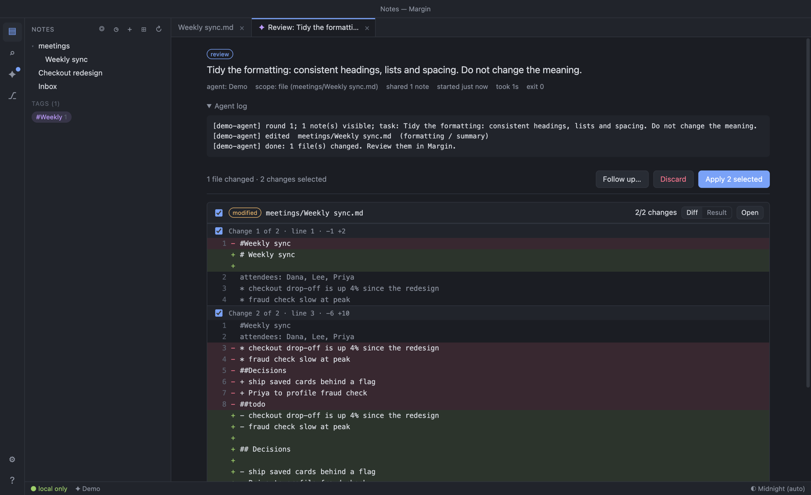
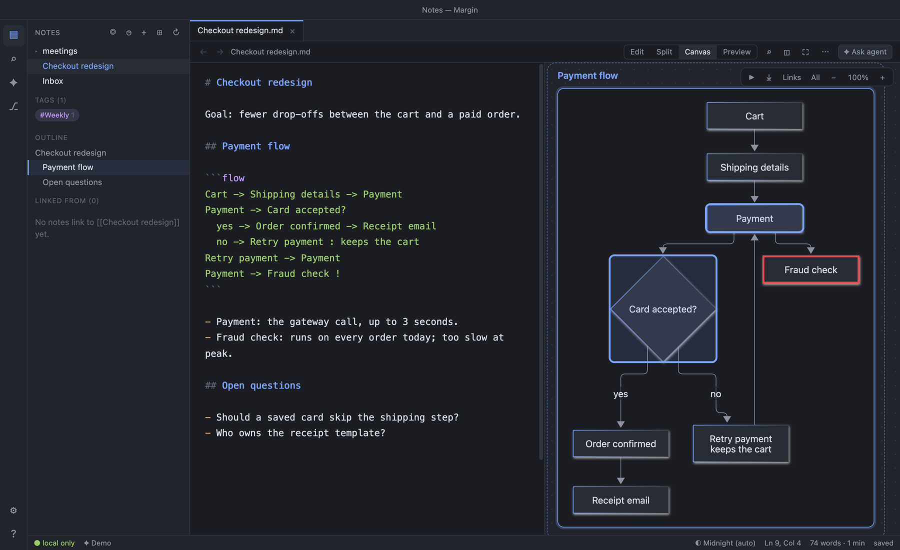
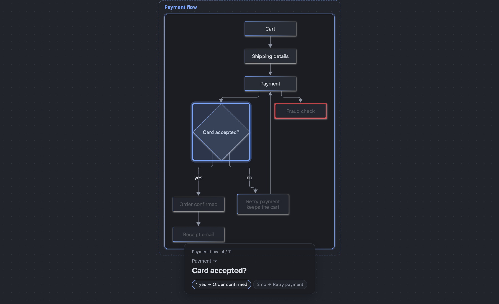

# Margin

A lightweight, local-first Markdown notes app where you and an AI agent work together.



- **Plain files.** Your notes are ordinary `.md` files in any folder — no database, no account, no sync.
- **Delegate, then review.** Ask an agent (Claude Code, Codex, or any CLI) to do something with your notes. It works on a copy; you review the diff and apply only the changes you want.
- **Private by default.** Nothing leaves your machine unless you run an agent (or turn on update checks), and notes marked `private: true` are never shared.
- **Fast editor.** Split preview, Mermaid diagrams (in notes or as `.mmd` files, copyable as images), themes, wiki links, backlinks, search, local git.
- **Diagrams you type.** A plain ```flow notation drawn as you write, on a canvas beside the editor that follows your cursor, links boxes of the same name, walks a flow with the keys and presents it full screen ([notation](docs/FLOW.md)).
- **Drawings.** Open and edit `.excalidraw` files, and embed them in notes with `![[sketch.excalidraw]]`. The Excalidraw editor ships inside the app, runs fully offline and is sandboxed away from your notes.

| Type a flow, see it drawn beside the text | Present it one step at a time |
| --- | --- |
|  |  |

## Download

Get the latest build from [Releases](../../releases): macOS (`.dmg`, Apple silicon or Intel), Windows (`.zip`), Linux (`.AppImage`). After that, **Check for Updates…** keeps the app current: updates are signed, and the app checks the signature before it runs them.

The builds are not signed with an Apple or Microsoft certificate, so the first launch needs one extra step:

- **macOS**: drag Margin to Applications and open it. If macOS says it can't be opened, go to **System Settings › Privacy & Security** and click **Open Anyway**. If it says the app is damaged, run `xattr -dr com.apple.quarantine /Applications/Margin.app` once.
- **Windows**: unzip and run `Margin.exe`. If SmartScreen appears, click **More info › Run anyway**.
- **Linux**: `chmod +x Margin-*.AppImage`, then run it.

## Run from source

```bash
npm install
npm start        # desktop app
npm run demo     # browser mode with sample notes and an offline demo agent
```

Requires Node.js 18+. To use a real agent, install and sign in to the [Claude Code](https://docs.anthropic.com/en/docs/claude-code) or [Codex](https://github.com/openai/codex) CLI, then add it under **Agent › Manage Agents…**.

More: [user guide](docs/GUIDE.md) · [flow notation](docs/FLOW.md) · [product notes](docs/PRODUCT.md) · [contributing](CONTRIBUTING.md)

## License

[MIT](LICENSE)
