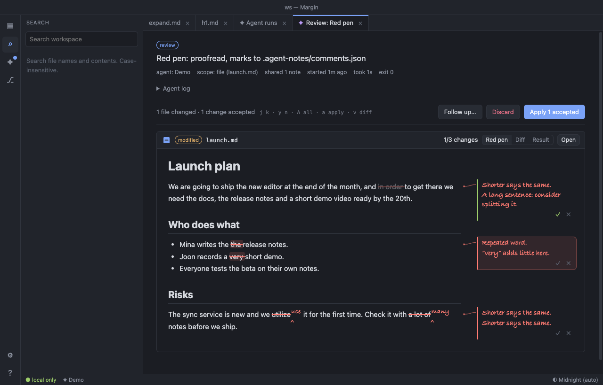

# Margin — User Guide

A lightweight, local-first workspace for plain Markdown folders. When you hand note work to an agent, the agent works **on a copy**, and you **review the result hunk by hunk and apply only what you pick**.

- Product direction, differentiators, why this MVP, roadmap: [docs/PRODUCT.md](PRODUCT.md)
- Runs as a desktop app (Electron) or in browser mode. The app code has no runtime dependencies (the only bundles shipped with the app are mermaid for diagrams and Excalidraw for drawings, both loaded only when needed), runs only on `127.0.0.1`, and uses no external network (the only exception is update checks the user turns on or requests).

## Running

### Desktop app (macOS / Windows / Linux, Electron)

```bash
npm install          # once (downloads Electron)
npm start            # run the app in development mode
```

- The menu also has the main commands (New Note ⌘N, Close Tab ⌘W, Settings ⌘,, Focus Mode, Choose Theme, etc.). ⌘W closes the tab, not the window; to close the window press ⌘⇧W.
- On first launch, choose **Open Folder…** (your Markdown folder), **Open File…** (a single note), or **Try Sample Notes** (sample notes + offline demo agent). The last opened folder reopens automatically on the next launch.
- Menus: **File › Open File… (⌘O) / Open Folder… (⌘⇧O) / Open Recent / Open Sample Notes / Reveal Folder in Finder**, **Agent › Choose Agent…**
- You can drag a note (`.md`, `.markdown`, `.mdx`, `.txt`) or folder onto the window or Dock icon, or use Finder's **Open With › Margin**. If the note is inside the open workspace folder or a recent folder, it opens there; otherwise the note's folder opens as the workspace and the note opens in a tab. Other files, such as images, dropped onto the note editor are attached.
- Agents are managed in the **Agent › Manage Agents…** window.
  - You can register several agents (Demo (offline), Claude Code, Codex, custom commands) and set a default. CLIs that aren't installed are shown as `(not installed)` in the presets.
  - Preset commands (pinned to cheaper models, no session history kept):
    - Claude Code: `claude -p --model sonnet --output-format stream-json --verbose --permission-mode acceptEdits --no-session-persistence` (shared notes are sent to Anthropic)
    - Codex: `codex exec --json -m gpt-6-sol -c model_reasoning_effort=low -s workspace-write --skip-git-repo-check --ephemeral --color never -` (shared notes are sent to OpenAI; writes are restricted to the copy folder)
    - Thanks to JSON output, the review screen shows **the agent's answer (Agent says)**, **step-by-step activity** (read/edit/run), and **tokens and cost**. Preset commands from older versions are replaced with the new commands automatically at app startup.
    - In the delegate dialog you can pick a **model per task** (Claude: Haiku/Sonnet/Opus, Codex: GPT-6 Luna/Sol). The server accepts only models on the list.
    - The delegate dialog and Agent panel check the CLI **login status** (`claude auth status`, `codex login status`) in advance and tell you if a login is needed.
    - To change the model, just change `--model`/`-m` in the command. To add another CLI agent as a preset, add one line to `AGENT_PRESETS` in `desktop/main.js` (requirements: runs non-interactively, takes the prompt on stdin, and edits files in the current folder).
  - The demo agent is not AI. It only understands keywords (tidy/summarize/tasks/red pen, and draw: a step on each flow and a callout on each picture); for any other request it changes nothing and says so.
  - Registered agents are chosen per task in the delegate dialog.
  - The login shell's `PATH` is read only when an external CLI agent is configured (to find CLIs in `~/.nvm`, Homebrew, etc.).
- **Quick capture**: Even when the app is in the background, **⌃⌥N** (Windows: Ctrl+Alt+N) writes a line to the Inbox or today's journal. It can be turned off in the File menu.
- To reduce macOS permission prompts, the keychain is not used (`use-mock-keychain`). The app stores no cookies or passwords.
  - macOS treats every new unsigned build as a new app, so it may ask for folder access again.
- All web permissions are denied; the only exception is the app's own UI **writing** to the clipboard (`clipboard-sanitized-write`, for copying links and images). Reading the clipboard is not allowed.
- App settings are stored in `~/Library/Application Support/Margin/config.json` (macOS).

Building an installable app:

```bash
npm test             # pure-logic tests such as flow notation and cursor→figure resolution (node --test, no dependencies)
npm run smoke        # launch the app in Electron and check core flows (open note, canvas, Links, present, review & selective apply). Uses a separate config folder and temp notes only
npm run lint         # check for mistakes that break at runtime, like undefined names (ESLint, dev dependencies only). CI (Linux) runs lint, test, smoke before building
npm run pack         # dist/mac-arm64/Margin.app (runs directly, no install)
npm run dist         # .dmg / .zip in dist/ (Windows: nsis, Linux: AppImage)
```

- Builds are unsigned. An app you build yourself opens directly on this Mac, but distributing to other Macs requires Apple developer signing and notarization (only configuration needs to be added; intentionally not done). `publish: null` means build output is uploaded nowhere.
- Building on an exFAT external disk copies symlinks, making the app nearly twice as large (600MB). Output to an APFS disk: `npm run dist -- -c.directories.output=/tmp/agent-notes-dist` (normal size: .app about 290MB, .dmg about 128MB).

### Browser mode (Node only, no install needed)

```bash
npm run demo            # copy sample notes to a temp folder and run with the offline demo agent
node server.js ~/notes  # your notes folder (no agent)
node server.js ~/notes --agent "claude -p --model sonnet --output-format stream-json --verbose --permission-mode acceptEdits"
node server.js ~/notes --agent demo --agent "my-agent --edit"   # several: the first is the default
```

Open the `http://127.0.0.1:4321/?t=…` address (with token) printed in the terminal. Options: `--port <n>`, `--no-open`, `--agent <cmd|demo>`, environment variable `AGENT_NOTES_AGENT`.

Both modes use the same server and UI. The desktop app launches `server.js` as a child process with Electron's built-in Node, and shows its UI in a locked-down window (`contextIsolation`, `sandbox`, Node disabled, external URLs open in the OS browser).

## Core flow: delegate → review → apply

1. Open a note and press **⌘K** (or `✦ Ask agent`).
2. Write a task or pick a recipe (Tidy / Summarize / Extract tasks / Link notes / Proofread / Draw as flow / Red pen / Comments only / Meeting minutes / Apply my comments, and your own from `RECIPES.md`, see below), and set the scope (this note / this folder / everything). **The list of files that will actually be shared, and the files excluded as private,** is shown before running.
   - **Draw as flow**: Proposes a ` ```flow ` block drawing a process, flow, or system right after the text that describes it. If the task contains "flow", a summary of the flow syntax (`lib/flow-notation.md`) is passed to the agent too. The result is reviewed like any other task, and you apply only what you pick. If you select text before running, only that part is drawn.
3. The agent works on a copy in `.agent-notes/runs/<id>/work/`. Your original notes don't change meanwhile, so you can keep writing: when the run ends, a message with a **Review** button says so (and a system notification, while Margin is in the background).
4. The review tab shows each changed note with the **red pen** (below): the changes marked on the note itself, to accept or reject one by one. **Diff** shows them as a diff with word-level highlighting and checkboxes per hunk, **Result** the note as it will read after applying.
5. Apply with **Apply N accepted** (or **Apply N selected** in the diff). If you don't like it, give further instructions with **Follow up…** (the agent continues on top of its own proposal), or **Discard**.
6. Even after applying, **Undo apply** reverts exactly. If you've edited the file again since applying, the undo is refused to protect your edits.

If you edited the same file while the agent was working, a 3-way merge lets you apply only non-overlapping changes; overlapping hunks are locked.

**Reviewing by keyboard (as in magit).** The review tab takes the focus when it opens. `j`/`k` (or `n`/`p`, ↓/↑) step through the changes, `J`/`K` through the files, `<`/`>` first/last. `x` or Space picks or unpicks the change (`X` the whole file), `A`/`U` all/none. `a` applies, `d` discards, `f` follows up, `u` undoes an apply. `=` switches the file between Diff and Result, `o` or Enter opens the note at that change, `l` shows the log, `g` loads it again, `q` closes it. A click works too and the keys go on from there. ⌥X a v opens the run that has waited longest for a look. The review is a buffer like the others (see *Margin's own buffers*).

### Red pen: the proposal on the note

The text is yours, the margin is the agent's. The review draws the agent's proposal on the note as an editor marks a proof: the note rendered as it reads now, what would go **struck through in red**, what would come **written in above a caret ‸** in a handwriting font (a whole new line is written in with ‸ before it), and the agent's reasons in the **margin**, in red, with a line to their place. Nothing on the note changes until you accept.



| Key | |
|---|---|
| `j` / `k` | next / previous mark |
| `y` | accept the mark (and go to the next) |
| `n` | reject it (and go to the next) |
| `x` / Space | accept ↔ reject, staying there |
| `A` / `U` | accept all / leave all open again |
| `a` | apply the accepted ones |
| `v` | red pen ↔ diff, for every review (remembered) |
| `o` / Enter | open the note at the mark |

Clicking a mark picks its margin note; ✓ and ✗ on each note do what `y` and `n` do. A mark is one change of the run (a hunk): lines changed one for one, as in a proofread list, are a change each, while two edits on one line are one mark with both reasons in its note. Accepting and applying are exactly those of the diff: the same apply, undo and 3-way merge, no other way of writing. Marks still open are not applied. Changes that overlap your own edits are shown but can't be accepted. Code blocks show as code, and a change of only spaces or empty lines is marked with ¶.

**How far each change reaches into your words.** Every change of a run carries a label, decided by fixed rules (`lib/tiers.js`), never by a model:

| | |
|---|---|
| **T0** | nothing of yours changes: a note the agent made, a remark in the margin |
| **T1** | added to your words, none taken away: new lines, a box ticked (`[ ]` → `[x]`), blank lines, or lines an agent wrote before (Origin's record of applied runs) |
| **T2** | your words taken out or written over — read each one |
| **T3** | in a paragraph you locked: not applied |

The label is on each margin note and diff hunk, and the highest one on the note's head. Above the notes, one line sums the run up — the new notes and remarks, the additions quoted in short, how many changes reach your words, what is locked; a part of it goes to its first change. It is only a label: the keys, and what is accepted or applied, stay the same. (A key that takes the T1 changes at once is left for later: whether it saves anything has to be seen on real runs first, and `A` already means "all" in every review.)

**As a proof.** Accepted, a mark's red ink is wet for a moment, then sets into the page. Rejected, the words that stay get the proofreader's dotted underline and its note says *stet* ("let it stand"). The agent writes in red in a hand; your own suggestions, comments and margin notes are in blue, typed. The current margin note, or the one under the pointer, lights its mark and the line between them, and the other lines step back. While a red pen page is in view, the app around it (activity bar, sidebar, tabs, status bar) dims, and comes back under the pointer. Motion in the app is in three lengths — 120, 200 and 320 ms; with reduced motion, the ink does not move.

**On pictures.** A change inside a ` ```flow ` block, or inside the ` ```ink ` marks of a picture, is drawn on the picture instead of as text: the flow with the proposal in it, a new step or arrow ringed in red, a removed one crossed out; on a screenshot the new marks drawn on it, glowing, the removed ones dashed and faint. Its margin note says what changes (`+ Retry · − Fax · arrows +1 −1`, `+ box, “Too small”`). `y` and `n` work as for text — taken, a new step turns green and a removed one fades; left, a new one fades — and **Result** shows the picture as it will be. A change that also touches the lines around the block (or the fence itself) stays text. The red pen shows in dark and light themes alike and uses a handwriting font of the system (Bradley Hand, Segoe Print, Ink Free…, and Nanum Pen Script for Korean where it is installed, as on macOS); nothing is downloaded. A long margin note shows three lines until it is the one in view. Notes on overlapping words share a place in the margin.

Two recipes ask the agent to write **in the margin only**, not in the note:

- **Red pen** (⌥X r 7): proofreading — for each thing worth changing, the better text and a few words why.
- **Comments only** (⌥X r 8): an editor's remarks on clarity, structure, gaps and claims to check, each next to the passage it is about, with no edits at all.

The agent writes these notes to `.agent-notes/comments.json` in its copy (any task that mentions that file, "red pen" or "margin notes" gets the format). Margin keeps them with the run, never in the note: a suggested text becomes a change on the proof, to accept like any other; a remark is a wavy underline with its note, which `y` marks as seen and `n` dismisses. A run with remarks only shows the note with them (and **Discard** closes it). A follow-up round keeps the notes of the rounds before.

**Space (Labs).** With Labs' experimental views on (Settings → Labs), `s` in a review, or the **Space** button, shows the same red pen paragraph by paragraph, as cards in depth: the one you are on is in front and sharp, the paragraphs waiting for a decision stand forward, the decided ones settle back (taken: green, left: grey). The agent's reasons are on the right of a card, your comments on the left. Decisions are the review's own — what you decide in the space is what the review shows when you leave it.

| Key | |
|---|---|
| `j` / `k` (↓ / ↑) | next / previous paragraph |
| `J` / `K` (`l` / `h`) | next / previous change |
| `g` / `G` | first / last paragraph |
| `y` / `n` | accept / reject (and go on to the next open change) |
| `x` / Space | accept ↔ reject |
| `c` | a comment for the agent on this paragraph (Enter keeps it, Esc drops it) |
| `f` | follow up: your comments, with what they are on, start the request |
| `z` | the whole note at a glance (`z`, Enter or Esc goes back to the paragraph) |
| `o` / Enter | open the note at the paragraph |
| `]` / `[` | the next / previous note of the run |
| `a` | apply the accepted ones |
| Esc / `q` | back to the review |

The comments are for the agent, not the note: they stay with the review (until it closes) and go out only when you follow up. The wheel moves along; a click on a card or a mark picks it. With reduced motion on, the cards don't float.

### Lens: what the agent sees in the note (experimental)

A lens asks the agent to look at the note in view without changing it, from one angle — three commands in M-x (⌥X :) or the palette (⌘P, then `>`):

- **Lens: claims without support** — numbers, causes, promises and judgements given as facts with nothing behind them.
- **Lens: places that disagree** — dates, numbers, owners or decisions that don't match.
- **Lens: decisions and open questions** — what is decided, what is still open, and the places they depend on.

Each fills in the task dialog, so you see what is asked and shared before it runs. The agent writes what it sees to `.agent-notes/lens.json` in its copy (any task that names that file gets the format); Margin keeps it with the run, never in the note, and keeps only findings whose quotes are really in the note.

The review draws them **on the note** — the same page as the red pen, as a layer of it (see *Layers* below): each place marked in the colour of its kind (no support, disagree, open, decided, together), the places of one finding **joined by an arc** in the gutter (short arcs inside, long ones round them; words of two findings striped with both), and the finding's card in the margin among the red pen's. The kind chips show or hide a kind. The current finding (or the one under the pointer) lights its places and its arc, with a line from each place to its card; a click on a marked place or an arc picks its finding, a quote in a card shows its place.

| Key | |
|---|---|
| `j` / `k` | next / previous finding |
| `x` | pick the finding for a fix (or unpick it) |
| `f` (or **Fix…** on a card) | follow up: the picked findings and the current one, written as a request for a red pen fix — edit it, then run it |
| `o` / Enter | open the note at the finding |

A fix comes back as a red pen proposal on the note, with the lens on the same page: nothing changes until you accept a mark and apply. The lens of a run stays with its follow-ups until one looks again.

### Forks: one paragraph, other ways (experimental)

**Forks: this paragraph, other ways** (M-x or the palette) asks the agent for two or three other ways of writing the paragraph at the cursor — or the selection — through the task dialog, with the paragraph quoted in the task. The agent writes them to `.agent-notes/forks.json`; the note doesn't change.

The review shows them **on the note, in the paragraph's place**: a tab over the paragraph (`◀ 2/4 ▶`) and a card in the margin. On the card, **← →** (`h` `l`, or the arrows on the tab) switch the paragraph between **as it is** and each option, right where it stands — what comes before and after it as it is, an option shown dashed as a preview, with a few words on how it differs. **=** (or **Compare**) shows all of them side by side under the note, and again hides them.

**Enter** (or **Take**) puts the one shown in the proposal: it is a change of the run like any other, already accepted — `a` applies it, `n` on its mark leaves it. Another option can be taken instead, and **Keep it** on the paragraph as it is takes it back. Only one paragraph at a time, and only that paragraph: the rest of the note isn't rewritten to go with it.

### Film: a note through the rounds of a run (experimental)

`F` in a review (or **Film**, shown once a run has a follow-up round or has been applied) plays the note through the run: **as it was**, each **round**'s proposal — with what you asked for it (the task, then each follow-up) and the agent's margin notes of that round — and what was **applied**. Each frame shows its changes from the one before as the red pen does, struck through and written in — going to a frame, only the paragraphs that changed are written in again, one after another. Over the slider, a bar for each frame is as tall as its change (characters taken out and put in), so the rounds that changed the most stand out. ← → (`h` `l`) step, the slider, the bars and the frames above it jump, Space plays, Esc closes. It only shows: nothing in it changes a note.

### Layers: one note, what is on it (experimental)

A review draws each note **once**. When a run has more than the red pen on a note — the lens, forks, or comments you wrote in the space — they are **layers** of the same red pen page, and the chips at its top (**Proposal**, **Lens**, **Forks**, **My comments**, with how many) show or hide each. Hidden, a layer's marks and cards go, and `j` / `k` skip them: with every layer shown they go through all the marks in the order of the note. With the proposal hidden, the note reads as it was shared (what the lens looked at). The diff view (`v`) shows the lens and forks apart, as before.

At the right of a long review, a **minimap** has a tick for each mark — red pen, the lens in its kind's colour, forks, your comments — where it is in the whole, the part in view shaded; a click goes there.

### Gather: pieces of notes, by hand (Labs)

In Labs: turn on **Experimental views** in Settings → Labs (or **Labs: experimental views on / off** in the palette) to find it.

**Gather: pieces of notes into one** (M-x or the palette) lays the note in view out as cards — a paragraph, a list, a table, a code block or a heading each, exactly as written — in a row that turns in depth, the one in front sharp. You go through them with a two-finger **swipe** on the trackpad (or ← →), **pull** the one in front **down** into the tray at the bottom (or ↓ / Space), and a **pinch** (or `z`) steps back to see the whole note as a grid. The chips at the top switch to the other open notes (Tab), and **+ Note** brings in any note of the workspace, so pieces of several notes go into one tray.

In the tray the pieces stay in the order you put them; drag one sideways (or `<` `>`) to move it, up out of the tray (or `x`) to take it out. **Make a note…** (Enter) asks for a name and writes a new plain Markdown note: the pieces as they were written, in the tray's order, and a line with `[[links]]` to the notes they came from. **Copy** (`c`) puts the same Markdown on the clipboard instead. The notes you gathered from don't change — Gather only copies — and nothing is written until you make the note. The tray is kept while the app is open, so you can close it, look something up and go on. Esc closes. With reduced motion on, the cards don't turn.

No agent is involved: it is a way of putting your own notes together by hand. It works with the trackpad, the mouse and the keys only — there is no camera and no hand tracking (Margin doesn't ask for the camera, and a model to follow hands would be a large dependency for less precise, more tiring work than a trackpad), and no free 3D space of notes to fly through (text is read best flat and in front, so the depth only shows where a card is in the row).

### The desk: cards to think with (experimental)

A **desk** is a plane to lay notes and thoughts out on, move them about, pile them up and think about them with the margin. It is a `.canvas` file — a [JSON Canvas](https://jsoncanvas.org), as Obsidian writes them, so the same desk opens there and Margin keeps what Obsidian wrote (colours, sides of the arrows, fields it doesn't know). Make one with the **▦** button at the top of the file tree (beside **+**, the new note), the palette's **New desk…** or a folder's right-click **New desk here…**; open one from the tree (▦).

**Open on a desk** (palette, on a note — a meeting's, mostly) makes a desk beside the note, *note desk.canvas*: the note in the middle, its open questions (`#question`, or `> [!question]`) and its to-dos not done as cards, in groups, and the notes it links to (`[[…]]`). Each card taken from the note says where from — a link back to its line — and stays as it was written; when the note settles the question or ticks the to-do, the card says so (*no longer open in the note*, *done in the note*) and dims. Made once; after that, the same desk opens.

- **Back to the note, in red pen**: a question card's **Decided…** (`d`) asks in what words (empty: as it was asked), a to-do's **Done** (`x`) ticks it; the card shows what it will ask of the note (*→ decided: “…”*, *→ done*; × takes it back) and nothing is written yet. The panel then has **Propose to *note* (n)**: all of that note's cards' asks at once, as one red pen review of the note — the question becomes a decision, the to-do is ticked — to accept (y / A) and apply (a) as any other. The cards say *proposed*, and once applied, *no longer open* or *done in the note*.

- **Cards**: drag notes (or pictures) from the tree onto the desk, or `f` to pick one; a note's card shows the note, read from the file (its front matter left out), and follows it when it changes; a double-click (or Enter) opens it beside the desk. Double-click the plane (or `n`) for a card of your own words; Enter or a double-click writes in it, Esc or ⌘Enter is done. A card's corner resizes it. A private note's card says so (*private · not sent*): it is on the desk, but never given to the margin.
- **Pictures**: drop pictures on the desk — from the Finder or a browser — or paste one (⌘V, at the pointer); each is saved next to the desk, in its `assets/` folder, and becomes a card the size of the picture. Several at once are one step to undo.
- **Marks on a picture**: `r` on a picture's card (or ⌥ and a drag on it, at any time) and a drag marks a part of it. The mark is a card beside the picture, level with the part, a line drawn from one to the other; write in it what it is or what you ask of it. **Ask** (`a`) gives the margin that part — and the whole picture, for where it is — and its answer comes beside the mark, dashed; Tab keeps it as the mark's answer. **Note…** makes a note of the mark: the part of the picture, what you wrote (a question as `> [!question]`), the answers kept, and a **Source** line linking back to the picture and the desk. The link is plain Markdown with a W3C media fragment, ``: elsewhere it shows the whole picture, in Margin's preview just the part, and following it opens the picture with the part marked. `j` `k` (on a picture or its marks) go through its marks, each in the light — the picture, the mark, its answers and its note — the rest of the desk dim; Esc shows it all again. Space on a mark reads it as layers, what it became — marked, written, an answer kept, noted — the newest in front, ↑ ↓ back and forth.
- **Reading**: Space (pressed and let go) shows the selected card — or the one nearest the middle — large in the middle of the desk, the panel out of the way; ← → go to the one before or after it in its group (or among the cards in none), in reading order; Enter writes in it — a card of your own, or the note itself (saved as you write: through its tab when it is open, else to the file, never over a newer one on disk; if it can't be saved, your words stay until a second Esc) — and Esc or ⌘Enter is done; `o` opens a note beside; Esc or Space goes back. Held down, Space with a drag moves the desk, as before.
- **Moving**: drag a card (the selection moves together, and a group moves with what is in it); drag the plane to select with a box, Shift-click to add; two fingers move the desk, a pinch zooms with your fingers, ⌘ and the wheel (or ⌘ and two fingers) in small, eased steps, `-` and `=` a step at a time; `z` shows all, `1` is 1:1; the arrow keys go to the next card that way, Shift and an arrow moves the selection. Going away, the cards' text fades little by little as their titles grow, until far away only the titles show, large enough to read.
- **Piles and groups**: drop a card on another and they become a **pile** — each a little lower than the one before so the titles show — in a group (named *Stack*; double-click the name to change it); drop more on it to add them. `g` puts a group around the selection. Delete takes cards off the desk (not the notes); ⌘Z / ⇧⌘Z undo and redo.
- **The margin** (the panel on the right) works on the selected cards (a group: what is in it), or, with none, on the cards in view: **Sum up** (`s`), **Questions** (`q`, what they leave open, each a card), **Sort** (`o`, into groups by subject), **Links** (`l`, which cards belong together, an arrow with a label each) and **Merge** (`m`, one note of them all). Drag cards onto the panel to give them to it, or onto one of its buttons to ask that at once. While it thinks, the cards it was given glow; its answers come in about one to four seconds. The cards it was given show the number it knows them by (*#2*), and a `#2` in its answer is a link to that card.
- **Over time** (`t`) follows meetings: from the meeting notes among the cards, it finds the meetings before and after them (*Previous meeting: [[…]]* near the top, either way, up to 24) and puts them in order — by the date in the front matter (`date:`), in the name or the title (2026-09-03, 2026.9.3, 20260903, 2026년 9월 3일); a note with none is placed after the meeting it names, and its date is estimated (≈) from its oldest kept version or when its file was made, and said so. Its card shows each to-do — the meeting it first came in, how many it came back in (the same words, without owner, date or tags), when it was ticked (from the note's kept versions: *ticked by* the first one with it done, or *done by* the meeting it came ticked in) — the questions that came back and the meeting they were decided in, and what was decided when. Then Tab lays the meetings out in a row below the cards, in order, each in a group named by its place and date, an arrow to the next (the notes not on the desk yet come onto it); Tab again keeps the card. It is worked out by rules, in Margin: nothing is sent. With no card selected, the notes in view that are in no series are left out when some are; a private note is always left out (the card may be kept, and given to the margin later). **Read into it** on its card asks the margin what the rules can't tell — the same to-dos in different words, what a later meeting changed (*October 20 → November 3*), what holds now, and up to three things to raise first, each with the reason the meetings show — under those headings, each line naming the meetings it comes from (#2). It is sent the card's facts and the meetings, oldest first, each with its date (as many of the newest as there is room for; never a private one); its answer comes beside the card, dashed, to keep or let go.
- **Nothing it writes is yours until you take it**: its cards stand beside yours, dashed — **Tab** (or Keep) makes the newest a card of the desk, **⇧Tab** (or Keep all) all that came with it (the questions of one request, in one ⌘Z), **Esc** (or ×) lets it go; **Make a note…** on a merge writes it as a new note, which then takes its place on the desk. A sort or links are shown first, where they would go (dashed); Tab takes them (the cards move into their groups, the arrows are drawn), Esc not. What it wrote and you have not kept yet is kept beside the desk, not in its file (`.agent-notes/desk/<desk>.json`): closed and opened again (or after a restart), the desk shows it as it was, dashed, still to keep or let go. A sort or links not taken are not kept.
- **The panel**: – folds it to its buttons, + opens it again (it is remembered).
- **Its language**: it answers in the language of the cards' words — not their titles (a Korean note under an English file name gets Korean), nor their tags, links or code; in a talk, in the question's; about cards without words (pictures), in the language most of the workspace's notes are in (else the system's). Settings → *Desk answers in* can say Korean or English instead.
- **Talk**: `/` (or the box at the bottom) asks about the cards; the margin remembers the talk, and the cards it was shown, until you close the desk. **On the desk** puts an answer beside the cards.
- **What is sent**: only when you ask, only the cards given (their text, the notes they show, and the pictures — a marked part of a picture with the whole of it), to Claude (Haiku unless Settings says another, see the live margin) through the `claude` command you are signed in to (a Claude Code agent is needed; the first time, Margin asks). The server reads the notes and pictures itself: a note marked private and what `.agentnotesignore` names are never sent — the panel says which were withheld — and a desk that `.agentnotesignore` names sends nothing. A session is kept warm for the next request, so it answers at once.

Text on the desk is always flat and facing you; the depth is in the lift of what you move, the shadows of the cards and the two layers of dots under them, which move at two speeds.

### Beside a note: locked paragraphs, the drawer, origin (experimental)

Three things Margin keeps **beside** a note, never in it — the note stays plain Markdown. They live in `.agent-notes/` (`locks/`, `drawer/`, `gathered/`, under the note's path) and go along when the note is renamed.

**Lock this paragraph** (M-x or the palette) locks the paragraph at the cursor, or the selection; again, it unlocks it. A locked paragraph has a faint red band in the editor. The agent is told which paragraphs are locked and to leave them, but that is not what holds them: whatever the agent does, Margin **won't apply a change to a locked paragraph** — in the review its mark says *in a paragraph you locked* and can't be accepted, `A` passes it by, and a run that would delete the note is not applied. Lines put in before or after it are fine. The lock is the paragraph as written: change it yourself and it is free again (lock it again if you want).

**Drawer: this note's scraps** opens a column beside the editor: things you set aside **for this note** — a quote, a link, a paragraph of another note — that aren't in it yet. **Drawer: set the selection aside** (or **+ Selection** in the drawer) puts the selected words in it; text, a link, or a tab (as a `[[link]]`) can be dropped on it, and words dragged from another note's editor keep where they came from (**from …** opens it there). **Insert** — or dragging a scrap into the editor — puts it in the note as a paragraph of its own; × takes it out of the drawer. The drawer is a plain Markdown file (`.agent-notes/drawer/<note>.md`), and the agent sees it when it works on the note, as material, not as a file to edit.

**Origin: where this note's paragraphs came from** shows the note with a coloured bar by each paragraph for each place it came from, as far as Margin knows: **the agent** (the lines an applied run put in, with what it was asked — *changed since* when you have edited them), **gathered from** a note (made with Gather), **the drawer** (a scrap from another note), **gathered into** another note, and **locked**. The card on the right says where the current paragraph came from, a thread joining them; the chips at the top are the sources — pointing at one lights its paragraphs and draws a thread to each. `j` `k` go through the paragraphs, `J` `K` only the ones with an origin, Enter (or the card's button) opens the run or the note there, `l` locks or unlocks, Esc closes. It only shows: nothing in it changes the note. What you wrote yourself, or pasted, has no bar — Margin doesn't watch the clipboard or other apps.

Not built, on purpose: a timeline of a note's whole life (Origin, Film and History each cover a part of it, and one more view of the same history would add little) and a wide-screen centre-and-periphery layout (it would mean another layout of the whole window, for wide screens only, for little gain over the drawer and split view).

### Suggesting: your own red pen, in a meeting

Margin's red pen is for you too, as tracked changes are in a word processor: made for leading a meeting with the note on a shared screen and correcting it as people talk. Only you write; it is not shared editing.

**Suggesting** (⌘⇧T, ⌥X p p, or ⌥X t p; the ✎ chip in the status bar shows it) keeps the note as it is while you edit it. What you delete stays in view struck through, what you type comes in in pen, on the editing screen itself — and in the preview, in the pen's handwriting. Your pen is blue, the agent's red (both in Settings → Pens). The margin's handwriting can be a plainer face that is easier to read: Settings → **Margin font** (Handwriting, Sans, Serif, Mono). The suggestions are kept as a run of yours, a staged copy beside the note, never in it: they survive a restart, the note can change meanwhile (they go on over it), and ⌘⇧T again stops suggesting with them kept (✎ Suggestions waiting). ⌘Z takes back your suggestions step by step.

Quick keys for a meeting:

| Key | |
|---|---|
| ⌘⇧X (⌥X p d) | strike the selection, or the line you're on and go to the next; again: unstrike |
| ⌘⌥R (⌥X p r) | replace: strike the selection (or the word) and type the new words after it |
| ⌘⌥M (⌥X p c) | a comment on the selection (or the line) in the margin; on a comment: a reply |
| ⌥X p n / p N | next / previous comment |
| ⌥X p x | resolve the comment you're on (Undo in the message); ⌥X p h shows the resolved ones |
| ⌥X p v | review your suggestions |
| ⌥X p s | a sketch: a blank board below the cursor, on the canvas with the pen up (see "A sketch" below) |
| ⌥X p f | the sketch at the cursor (or looked at) as a flow block below it (see "A sketch as a flow" below) |
| ⌘⇧M (⌥X p m, ⌥X t m) | meeting mode on / off |

A comment may start with who said it, `@Mina …` (Tab completes a name used before), and 🕑 adds the time (remembered). Comments are kept beside the note, in `.agent-notes/comments/<note>.json`, never in its text; they go with a renamed note, have replies, and are resolved, not deleted. An agent asked about the note reads the open ones.

**Meeting mode** is for sharing the screen: large text, the line you're on highlighted, the marks heavier, and nothing else — no file tree, tabs, toolbar or path; the title says only "Margin", and the status bar shows only the pen and the keys. The same key leaves it, as it was.

**After the meeting**, ⌥X p v opens your suggestions in the red pen review (in blue, with your comments in the margin): `y` / `n` / `A` and `a` apply, as for an agent's — the same apply and merge, no other way of writing. Then two recipes:

- **Meeting minutes** (⌥X r 9): clean minutes from the note, your corrections and comments folded in, with the decisions and the action items as tasks (`- [ ] what @owner 📅 date`), as red pen marks to accept.
- **Apply my comments** (⌥X r 0): the agent revises the note as your comments ask, a mark for each.

### Meetings: the rail, the wrap-up, the decision wall, and in space (experimental)

For a meeting run from the note: what it **decides**, leaves **open** and **hands out** is written in the note as plain Markdown any app reads — your own lines, where you wrote them (in their list, at their depth), with a tag at the end saying what each is:

```markdown
## Launch date (10m)

- launch date
  - 20th? marketing ok, support ok
  - go with the 20th #decision
    - [ ] Draft the release notes @ann 📅 2026-10-12
  - press kit? #question
- store review can take a week #risk
- a first month free instead of a discount? #idea
- the offer range #next
```

— a decision, an open question, a to-do (a box in its list item), a **risk**, an **idea**, and a topic left for the **next meeting**. The preview shows a tag as a small mark in its colour (*decided*, *question*, *risk*, *idea*, *next time*) and leaves the list as it is; in other apps they are tags, and a search for `#decision` finds every decision. Callouts — `> [!decision] …`, `> [!question] …`, `> [!warning] …`, `> [!idea] …`, as earlier meetings were written — are read just the same; marking one again makes it a plain line with a tag.

— and Margin gathers it as you go and after.

**Meeting rail** (M-x or the palette, ⌥X p M) puts a rail beside the note in meeting mode (and turns meeting mode on). At the top, the **agenda**: the headings with minutes in them, `## Status (5m)` (or `(10 min)`), as a bar, each with a clock that runs while the cursor is in that item — the bar fills, and turns red past its minutes. Below, three lanes — **Decisions**, **To-dos**, **Questions** — fill as they are written, and a fourth, **Risks · ideas · next time**, when there are some; a new one flies from its line to its card, and a click on a card goes back to the line. The rail is off until you turn it on, and meeting mode is as it was without it.

Marking a line, in a meeting:

| Key | |
|---|---|
| ⌘⌥1 (⌥X p 1) | the line is a decision (`… #decision`, where it is); again: plain words |
| ⌘⌥2 (⌥X p 2) | the line is a to-do (`- [ ] …`, a box in its own list item); write `@who` and `📅 YYYY-MM-DD` in it |
| ⌘⌥3 (⌥X p 3) | the line is an open question (`… #question`) |
| ⌘⌥4 (⌥X p 4) | the line is a risk (`… #risk`) |
| ⌘⌥5 (⌥X p 5) | the line is an idea (`… #idea`) |
| ⌘⌥6 (⌥X p 6) | the line is for the next meeting (`… #next`) |
| ⌘⌥↩ (⌥X p g) | the next agenda item: a new line at its end, its clock running |

With the rail on, a line started with `! ` (a decision), `[] ` (a to-do) or `? ` (a question) becomes one when you end it with Enter — `- ! go with the 20th` becomes `- go with the 20th #decision` — with Korean input too.

**Wrap up** (the rail's **Wrap up ▸**, ⌥X p w, or M-x *Meeting: wrap up…*) asks the agent, as a task you can still change, to add a **Wrap-up** section at the end of the note — what the meeting did, the time each agenda item took (from the clock), the to-dos **by owner**, the decisions, the open questions, the risks and the ideas — and to write the **next meeting's note**: the same name a week on when it has a date in it (`Weekly 2026-10-05` → `Weekly 2026-10-12`), the same agenda, the open questions and the `#next` topics carried over under their items, and a line `Previous meeting: [[…]]`. It comes back as a run to review and apply, as any. **Fold** (⌘⌥⇧↩, ⌥X p z, or M-x *Meeting: fold…*) is the quick one, in seconds and without an agent: the minutes the live margin wrote and nobody let go go into the note as ⌃↩ would keep them, a **Wrap-up** section at the end lists the to-dos by owner — each stays where you wrote it, under its item; the wrap-up shows only its words, crossed out when done, and a link to its section (`[[#Launch]]`) — with a two- or three-sentence summary the live margin writes (when it is on), the time on each item, the decisions, questions, risks and ideas again and `Next meeting: [[…]]`; the change is proposed for review, and the next meeting's note is made at once when there is none. Folding again redoes the section. The next note then shows a **Since last time** card at the top: the previous meeting's to-dos by owner, how many are done (the ring), and what it decided; a click opens the previous note at that line, × hides it.

**Decision wall** (the rail's **Wall ▦**, ⌥X p b, or M-x) shows the meeting on one screen: columns of cards — **Decided**, **Open questions**, one for **each owner**'s to-dos, and the to-dos with no owner — beside the note. Pointing at a card draws a thread to its paragraph in the note. **Drag** a card to another column — a to-do to someone else, a question to Decided, a decision back to Open, a question to someone as a to-do — or click ☐ to check a to-do off; the cards slide to their places, and **Propose to the note** sends the changes back as a red pen proposal to review (`y` `n` `A` `a`), like your own suggestions: the wall never writes the note itself. **Copy PNG** (`c`) copies the wall as a picture, drawn sharp, for a chat or a slide. Esc closes.

**In space (Labs).** With Labs' experimental views on (Settings → Labs), three views give the meeting some depth, with CSS 3D only (no WebGL, nothing loaded): the words you read and write stay flat and face you, and with **reduce motion** on in the system settings, all three are flat — the rail and the wall as above.

- **Depth stage** (M-x *Meeting: depth stage…*, ⌥X p D; it turns on the rail and meeting mode) puts the rail behind the note: its lanes are glass panels going back in depth, leaning a little as the pointer moves; a new decision, to-do or question flies back from its line into its lane; pointing at a lane brings it forward, flat, to read. The agenda's clock becomes an arc on the floor below — an item's share of the arc its minutes, filling as its time runs, red past it, with the item now and its time upright under it. The note itself never moves. Again to turn it off.
- **Agenda tunnel**: on the stage, ⌘⌥↩ (the next agenda item) goes down a corridor of gates, one for each item, from the one you were in to the next — what the finished item decided and handed out on the walls on the way, a gate past its minutes glowing red — and back to the note in about a second and a half.
- **Decision orbit** (the wall's **Orbit ◎** or `o`, ⌥X p o, or M-x *Meeting: decision orbit*) shows the wall's cards in space: the agenda items as sectors of a floor, the decisions high over the middle in their item's sector, the open questions going slowly round an outer ring, and a pillar for each owner with their to-dos up it (one for no owner). Drag the floor to turn it, pinch or scroll (or `+` `−`) to come nearer, `←` `→` to turn, `1`–`9` to fly to an agenda item, `0` for all of it. Pointing at a card draws a beam down to its place on the floor and shows its line as written. **Throw** a card — at a pillar (that person's to-do), the middle (decided) or the ring (open) — and it lands there: the same change as dragging it on the wall, proposed to the note with **Propose to the note**. Copy PNG (`c`) draws the orbit as the camera sees it; Esc goes back to the wall. The cards are flat and only moved and scaled, so their words stay sharp; with very many, each part shows as many as fit (a pillar 8, decisions 14, questions 18) and how many more.

**Live margin (experimental, off until you turn it on).** M-x *Meeting: live margin…* (⌥X p l; it turns meeting mode on) writes the minutes of each line beside it as you take notes: when you end a line (Enter) or stop typing for about half a second, the line — with the meeting's title, its agenda item and today's date — goes to Claude Haiku through the `claude` command you are signed in to (a Claude Code agent is needed; nothing else is sent, a private note is never sent, and no key is kept by Margin). A chip — decision, to-do, question, risk, idea, next time, owner, date — shows at once from the words, and the sentence is written out beside the line as it comes, in about a second; typing on in that line cancels it. Headings and empty lines get none; a line that asks — it ends in `?` or has `??` in it (`press kit?? bob unsure`) — is a question even with a name in it (unless the model makes it an idea, a risk or one for next time); and if the model talks to you instead of keeping minutes (*I'm ready to take minutes…*), that is dropped, not shown. It is only a suggestion: **⌃↩** (Control+Return on a Mac; Alt+Enter on Windows and Linux) keeps the nearest one above the cursor — what the line is, not the margin's words: your line stays as you wrote it, in its list and at its depth, with its tag added at the end (`#decision`, `#question`, `#risk`, `#idea`, `#next`; a to-do gets its box, `@who` and `📅 date`; a line you marked yourself, `! …` or a tag, keeps your mark), the cursor after it; the margin's sentence stays in the margin. ⌃↩ again keeps the one above it; **Esc** lets it go. Not ⌥↩ on a Mac: the Korean input takes it as its hanja key (with another input it still keeps); and while an input method is still composing a word, neither key touches the margin. **Tab** and **⇧Tab** are never the margin's: they indent and outdent the list as anywhere, so you can write in levels with the margin on. Its column beside the text is there from the moment it is on, so what you write doesn't move when the first minutes come. A small panel in the top corner shows, for each line, the time from your pause to the first letter and to the whole sentence, and the median and p90 so far. While the live margin is on, its session stays up — started with the app, kept between meetings, started again if it ends — so the first line is as quick as the rest; it costs nothing while it waits. Again to turn it off (and the session ends).

**Its model and effort.** Settings → *Live margin and the desk's margin* picks the model (Haiku, Sonnet, Opus) and the effort (Default, Low, Medium, High) for both the live margin and the desk's margin. The default is Haiku with the default effort — Margin then tells it not to think, the quickest and the cheapest; an effort is passed to the CLI as `--effort` and lets the model think that much. Changing either starts the waiting sessions again with it. The panel in the corner names the model that wrote the last line (as the CLI reports it, `haiku-4-5`, `sonnet-5-5 · low`). Measured on a few meeting lines (October 2026): Haiku's first words in about 0.5 s, about $0.0016 a line; Sonnet with Low about 0.6 s and about the same per line (Sonnet's prompt is cached and Haiku's is too short to be; a session's first line costs a few times more), but 2–3 s on a line it stops to think about; Opus about 2 s and 3–4× per line. One setting for both: the desk asks seldom and the meeting often, but both are the same kind of short answer, and two settings would mean two warm sessions to keep apart for little gain.

**Its agent and its state.** With more than one Claude Code agent in Settings → Agents, **Agent** there picks the one the margins go through (**Automatic**: the default agent when it is Claude Code, else the first that is; only its command's program is used, `claude`, with the margin's own flags). Under it (or M-x *Meeting: live margin status…*) Margin says which agent it is, the program it runs, whether it is signed in (`claude auth status`), and the session: up, how many lines, since when, its last answer and its last error — and, in red, when a line has waited more than 15 seconds. **Test** sends one line (`-> go w/ the 20th`) through a session of its own and says how long the first words and the whole took, which model wrote it and what — or what went wrong (*Not logged in*, *“claude” was not found on your PATH*, the CLI's own last words when it ends). **Restart session** ends the margin's session (and the desk's) and starts a fresh one. A session that sends no word back for 40 seconds while a line is out — after a night asleep, a lost connection — is ended by itself, and the line goes once more on a fresh one; an error the CLI answers with is said as one, in the line's card and in the corner, never shown as minutes.

With a `Previous meeting: [[…]]` line in the note, the live margin also knows that meeting (what it decided, its to-dos open and done, its questions and risks, what it left for this one; not when it is private). A line that goes against it, repeats it or closes one of its to-dos gets a remark under its minutes — *Last meeting set October 20. Changed?*, *Closes last meeting's to-do.* — as does one that goes against something said earlier in this meeting. **Ask the margin:** a line starting with `??` (`?? when did we say the beta ends`) is a question, not minutes: the answer comes beside it, from this meeting's note and the last one; ⌃↩ keeps it in the question's place, Esc lets it go.

**The project.** When the note's front matter names a project (`project: Launch`, `project: "[[Launch]]"`, a list under `projects:`) — or, with none, tags (`tags: [launch]`) — the live margin is also told about the other notes that share it, newest first: what each decided and left open, or, for a note with none of that, its first paragraph (about 3,000 characters at most). Remarks then reach back over the whole project (*the brief says 500,000 won a person — changed?*), and a `??` question also gets the lines of those notes most of its words are in, so the answer can say which note it comes from. Private notes and those `.agentnotesignore` names are never among them. The corner shows what the margin knows (*knows project Launch · 4 notes*); it is read again when the front matter changes, or after a couple of minutes.

**Brief: a secretary in the margin (Labs).** Turn on **Brief: a secretary in the margin** in Settings → Labs (with Experimental views), or run M-x *Brief: this note*. A note that reads as a meeting — `Previous meeting: [[…]]`, lines tagged `#decision`/`#question`, `Attendees:` near the top, or a meeting word in its name or title (*meeting*, *1:1*, *retro*, *회의*, *미팅*, *회고* …; *sync*, *weekly*, *review*, *kickoff* only with a date or an agenda) — gets a headline pinned at the top of the margin, staying there as you scroll:

- **To cover**: the agenda (or the note's sections), each ticked once something is written under it.
- **From last time**: what the previous meeting left — its open questions, its `#next` lines, its to-dos not done — each ticked once this note speaks of it (or another note settled it since: *→ that note*); **+ here** puts one at the end of this note as it was (a question, a to-do, a topic).
- **Since then, elsewhere**: what notes written after the last meeting decided, asked or ticked about what it left.
- **Still needs**: no decision, no next step, no summary, questions still open, many to-dos with nobody or no date.

Beside the lines, at once and by rules only: a to-do with nobody on it (when the note names people) or no date, a date before the meeting, past or on a weekend, one to-do with two dates — here, or here and in another note. Nothing is sent for any of this.

**Check** in the headline sends the note (up to 8,000 characters), the last meeting's note and up to twelve paragraphs of other notes near it, with what the rules already said, to Claude (the thinks-along model; asked once), which adds only what rules can't see: **To settle** (in the headline), **Doesn't add up** (two things that can't both hold, in the note or with another note: a decision made otherwise, another date, a premise newer notes no longer support), **Doesn't follow** (numbers, a step that needs something later), **Needs** (what the record lacks to act on), and **Why?** — a question about a decision whose reason isn't written; **Answer** → **Put it in** writes your line under its paragraph. **Brief: check with Claude by itself** (Labs) checks after you pause for 25 seconds in a note it briefs, at most every two minutes. A draft (*blog*, *post*, *draft*, *초안* … in its name, or a `blog/`, `drafts/` folder) is briefed as a draft — its outline, placeholders, long paragraphs, and from Claude the point it makes, what the reader will miss, what goes against your own notes — and a plan (*plan*, *proposal*, *roadmap*, *spec*, *계획*, *기획* …) as a plan. **Brief · Meeting** in the headline switches what it is read as (or off for the note). A private note, or one .agentnotesignore names, is never sent.

**Themes: what keeps coming back (Labs).** M-x *Themes: what keeps coming back in your recent notes* sends paragraphs of the notes you changed in the last two months (up to 120 — with the local model on, those with others like them in other notes first; never a private or ignored note) to Claude, which names at most three things that come back in at least three paragraphs of at least two notes: a claim, not a topic, with the paragraphs (each opens its note), its reading of them (a suggestion) and what isn't checked yet. **Make a note** puts one in `Themes/`; nothing else is written.

Not built, for now: tidying a whiteboard sketch into a flow beside it, replaying how the note grew during the meeting, the chain of meetings in depth, and the review as layers apart.

### Recipes: your own tasks as commands

A recipe is a task for the agent written once and run by name — the agent takes the place Emacs gives to elisp, and like everything an agent does, what it changes comes back as a run to review. Recipes are text only: a name, what to ask, which notes to share. No code runs and there are no plugins.

Margin has ten (Tidy, Summarize, Extract tasks, Link notes, Proofread, Draw as flow, Red pen, Comments only, Meeting minutes, Apply my comments: ⌥X a 1–9, 0 or ⌥X r 1–9, 0). Add your own in **`RECIPES.md`** at the top of the workspace (⌥X r e makes it with two examples, or the ＋ next to the recipes in the task dialog). Each `##` heading is a recipe; the lines right under it may set:

```markdown
## Meeting notes to decisions
key: m
scope: note

Turn these meeting notes into a decision log: …
```

- `key:` one letter or digit for ⌥X r (`e` is taken: edit the recipes)
- `scope:` `note` (the note in view), `folder` (its folder) or `workspace`
- `ask:` `yes` shows the task dialog first, `no` goes straight to the agent

Each recipe is a command: ⌥X r and its key, or by name in M-x (`Recipe: …`), and a chip in the task dialog that fills in its task and scope. A recipe for the note in view goes straight to the agent, in the background (the selection, if any, is its focus); a message says when the run is ready for review. One for a folder or the workspace shows the task dialog first — with the notes it would share — unless it says `ask: no`. Private notes are never shared either way. A recipe with the name of a built-in replaces it. Mistakes in the file (an unknown scope, a key of two letters) are shown with their line when it is saved, and the other recipes still load. Runs from a recipe show its name in the runs list and the review tab.

### Margin's own buffers

What Margin shows that isn't a file is a buffer like a note, as in Emacs: the review of a run, **Changed outside**, **Tasks**, **Search** results, **Agent runs**, **Messages**, a note's **History** and its changes since the last commit. Each is a tab, is in the buffer list (⌘⇧B / ⌥X b b — where the ones not open yet are listed too, ◇, to open from there) and in ⌥X `` ` ``. They all take the same keys:

| Key | |
|---|---|
| `j` / `k` (`n` / `p`, ↓ / ↑) | next / previous item |
| `<` / `>` (Home / End, `G`) | first / last |
| Enter / `o` | open it (the note at the change, the result, the run…) |
| `g` (or `r`) | refresh |
| `q` | close the buffer |

The rest are each one's own (`y`, `n`, `x`, `a`, `v`… in a review; `x`, `a`, `h` in Tasks; `/` in Search to search again; `t` new task and `v` next review in Agent runs; `R` restore in History, where `j`/`k` step through the versions). The `j k · …` hint in each head lists them, and M-x shows them first while that buffer is in view. ⌥X b also opens them: `m` messages, `r` agent runs, `s` search results, `x` tasks, `c` changed outside. The search buffer is the same search as the sidebar's, so F8 steps through it from the note.

### A folder as text (dired)

⌥X d shows the folder of the note in view as a buffer — a line for each thing in it, folders first and ending in `/` (⌥X f d, M-x "Dired", or right-click a folder in the tree for another folder). `j`/`k` move, Enter opens (a folder goes into it), `^` or `-` goes up, `g` reads it again, `e` edits the folder as text (`R`: the same, with that line's name selected).

Editing is plain text editing: change a name and it is a rename; change it to a path (`../archive/`, `archive/` for a folder here, `/notes/x.md` from the top) and it is a move; delete the line and it goes to the trash; a new line is a new note (`.md` added) or, ending in `/`, a new folder. A line only moved within the list changes nothing; a name without its extension keeps it. ⌘S (or C-c C-c) doesn't do any of it: it shows the plan in the review — the list in red pen with a note in the margin on what each change does ("Rename ideas.md → ideas-2026.md (links follow)", "old_draft.md to the trash", "Move … · it will be withheld from agents there (.agentnotesignore)") — to take with `y`/`n`, `A` all, and `a` to apply; `q` (or `e`) goes back to the text, C-c C-k (or Esc with nothing changed) leaves it. A change that can't be done (outside the workspace, a name kept for Margin or git, a name already taken, two lines to the same place) says why and can't be taken.

Applying does the renames and moves as ⌥X f r does — [[links]] and embeds to the notes follow — puts the gone ones in Margin's trash (`.agent-notes/trash`, with "Undo trash" in the toast) and never deletes anything for good. A line changed in place is read as a rename of that line; when lines are removed and added in one place the similar ones pair up as renames and a line naming a folder that is there (`../archive/`) is where the one beside it went.

### Tasks in all notes

⌥X f x (palette: `Tasks in all notes`) lists every `- [ ]` in the workspace in one tab, like org-mode's agenda or Obsidian Tasks: **Overdue**, **Today** and **Upcoming** by their date (`📅 2026-10-05` or `due:2026-10-05` anywhere in the line), then the rest by note. Tasks in code blocks and in `templates/` are left out. `j`/`k` move, `x` or Space checks one off in its note (or on again), `o`/Enter opens the note at it, `a` opens it and asks the agent to do it (the task is prefilled; the agent checks it off in its proposal), `h` shows the done ones too, `g` refreshes, `q` closes. The list follows changes to the notes.

### The margin remembers

Beside a line of the note you are writing, the margin shows what your other notes already say about it, with where (click a name to open that note at the line):

- a to-do (`- [ ] …`) that is **open elsewhere** too, or was **done already** (ticked in the newest note that has it); one ticked here that is **still open** elsewhere;
- a question (`#question`, `> [!question]`) **asked before** and not decided, or **decided** (the same words marked `#decision`, or a decision near them);
- a decision **decided before** on the same thing — in other words, it may undo an earlier one — or one that **answers** a question open elsewhere;
- any other line whose words are near a decision made elsewhere: that decision;
- a paragraph — any note, any prose — about the same as a paragraph of another note: **Related**, with its first words (the nearest few notes; at most 8 such cards in a note, the strongest).

The same to-do is the same words without its owner, date, tags and punctuation; "near" is most of the same words (Korean particles aside) — words in many of the notes' items, a project's name, don't count. Paragraphs are compared by their words and, for Korean, the two-letter pieces of them (so 릴리스 and 릴리즈 share 릴리) with verb endings aside, the rarer a word in your notes the more it counts — no model, no download. The newest notes come first, up to about 3 MB of text. Its date is the note's date (front matter, name or title; ≈ when it is estimated from the file). Rules only: the notes are read on this device and nothing is sent. × lets a card go on that line for good; Settings → **The margin remembers** turns it off. A note that has shown one keeps its margin, so the text doesn't move as cards come and go. When the cards go on below the end of a short note, the wheel goes on scrolling the margin once the text is at its end; over a card, the wheel scrolls the text. A thin bar in the card's color runs beside the lines a card is about (a card can sit lower than its line when others are above it); point at the card, or put the cursor in those lines, and they are underlined with a dashed line that goes on to the card.

**It asks, now and then.** What it can't tell, it asks — one question at a time, beside the line nearest the cursor (never the line or paragraph you are writing), at most 20 a day:

- **The same to-do?** A to-do near one in another note, in other words ("Draft the release notes" and "Release notes draft"): **Same** makes them one from then on (open elsewhere, done already…), **Different** stops the question.
- **Does this replace that?** A decision near one made before: **Replaces it** — from then on, a line about it meets the newer one ("…, it replaced …"); **Both hold**; **Not related** (no longer shown as near).
- **About the same thing?** A paragraph close to one in another note it doesn't link to yet: **Link it** puts `[[that note]]` at the paragraph's end (a plain wiki link — the note now says it, for any app); **Not related** stops showing them together.
- **By when?** An open to-do with someone on it (`@ann`) and no date, or a line that says something is to be done ("need to", "…해야 한다") with no day in it: a day puts `📅 2026-10-16` at the end of the line; **No date** stops asking.
- **What is this note about?** A note with no `project:` whose lines or paragraphs meet notes that have one: the project goes in its front matter.

An answer about one line goes in the line (or the front matter) — one ⌘Z takes it back. One about two notes goes in **KNOWN.md** at the top of the folder: a note of yours with one plain line an answer (`- Same to-do: "…" (note) = "…" (note)`), to read, change or delete like any other — the margin follows it. **Not now** waits a day. Settings → **The margin asks** turns the questions off (what it remembers stays).

**It understands, with a local model (optional).** Words alone miss a paragraph that says the same thing in other words ("people leave right after signing up" and "too many new users drop off on the first screen") or in another language. Settings → **The margin understands** turns on a small multilingual model ([multilingual-e5-small](https://huggingface.co/intfloat/multilingual-e5-small), int8) that reads each paragraph as a vector, so **Related** and **About the same thing?** find those too. It runs on this device, in the background of Margin's own server (WebAssembly on the CPU, about 400 MB of memory while on): **your notes are never sent**. The first time, **Download** fetches it once — 149 MB: the model at a fixed revision from Hugging Face and ONNX Runtime's WebAssembly from jsDelivr, each file checked against the SHA-256 Margin ships with before it is used — into the app's data (`models/`), for every folder. It then reads the folder's paragraphs (a few thousand a minute, kept in `.agent-notes/embed/` so each is read once; with hundreds to read, two more copies of the model read along — about 450 MB more each, gone when it is done): the newest notes first, up to 3 million characters (20,000 a note) — Settings says how many older notes that leaves out. The status bar shows it while it gets ready — **◌ Local model: downloading 40%**, **◌ Reading notes 62% · 3,100 of 5,000 paragraphs**, then **Notes read** for a moment — and when it is stopped; click it for Settings. Until then paragraphs meet by their words. Private notes and ones `.agentnotesignore` names are read too: they stay on this device, and are never sent to Claude. A paragraph is shown as related when it is far nearer than the rest of your notes are to it — the more notes, the further — or nearly the same. **Remove** deletes the model; turned off, the margin goes back to words.

**It reads them with Claude (optional, sends).** Found near is not always about the same thing. Settings → **The margin reads them with Claude** has a fast model say how each paragraph found relates to yours, in a line beside its note: **Same thing**, **Answers it**, **Goes against it** or **Adds to it** — and the ones not really about it are left out, as cards and as questions. Unlike the rest of the margin, this **sends**: a paragraph of the note in view and the (at most three) paragraphs it met, to Claude through the Claude Code agent you signed in to (the live margin's model, Haiku unless chosen in Settings → Live margin), a few seconds after you stop typing — never the paragraph you are writing, nor a paragraph of a private note or of one `.agentnotesignore` names (those stay as found). While it reads them, the card shows ··· by its name. What it said is kept in `.agent-notes/judged.json`, so a paragraph goes again only when it or the other changes. Off unless turned on.

**It thinks along with Claude (optional, sends).** Settings → **The margin thinks along (Claude)**: a paragraph you have just written — once you leave it, or after a pause on a finished sentence — gets one or two things beside it when they help — mostly what your notes already know — and most get none:

- **To do**: it says something is to be done, even in passing ("I should send the notes by Friday", "…해야겠다"): what, and **By when?** — the day it suggests marked, Today, Fri, Mon or another; a day puts `📅 2026-10-16` at the end of the paragraph.
- **A thought**: you are weighing something ("whether to drop the tutorial altogether…"): what your notes said about it before — only from them, with the notes it comes from.
- **Goes against**: what the paragraph says or plans, and a note of yours decided otherwise ("let's ship the team plan this month" — the pricing note put it off to next quarter).
- **A question**, **Next step**, **A risk**: one your notes raise about this paragraph in particular, or that blocks what it plans — not a remark anyone could make.
- **From your notes**: you are reaching for something ("what did we settle the price at?", "??"): the answer, from the note that has it. When the paragraphs near it don't have it, Claude names what to look for, and the local model (when it is on) looks through your notes for it.

While Claude thinks about a paragraph (a few seconds), a dashed **Thinking ···** stands beside it. A card it gives takes the place of the paragraph's Related card and question. It goes only for paragraphs written or changed since the note was opened — opening a note sends nothing — at most 80 a day, and what it said is kept (`.agent-notes/thought.json`), so a paragraph goes again only when it changes. It **sends** that paragraph, the text before it in the note (up to 1,500 characters) and up to five paragraphs of other notes near it, to Claude through the Claude Code agent you signed in to; never a private note, nor one `.agentnotesignore` names. **Thinks with** Sonnet unless you choose Haiku: Sonnet tells a note about the same thing from one that only shares a word ("the launch" of the app is not the launch of a price plan) and gets days right, in a few seconds — nothing waits on it; Haiku is quicker and cheaper and gets those wrong more often. × lets a card go for good. Off unless turned on.

**Develop this note (Claude, when you ask).** For a note that is an idea, a plan or a draft — where there is nothing to remember or schedule, but a thought to grow — the command **Develop this note** (⌘⇧P) sends the note (up to 8,000 characters) and up to twelve paragraphs of your other notes near its paragraphs (found by the local model when it is on, else by their words) to Claude, through the Claude Code agent you signed in to, with the model Settings → The margin thinks along names (Sonnet unless Haiku). Beside the paragraphs they are about come: **More concrete** — the note's claim made more precise than the note says it (only when it can be, and never with a choice or value the note doesn't make); **A question** or two that would make it concrete; **Your notes back it**; **Goes against it**; **Next step**; and **Belongs here** — paragraphs of other notes that are pieces of the same idea (not a similar topic, nor a task about it; the same words in two notes count once), each with **Link here**, which puts `- [[that note]]` at the end of this one. Only what helps comes; the note itself is never changed but by Link here. **Answer** under a question opens a box in the margin: write a sentence or two and **Send** (⌘↩) — your answer, the question, its paragraph and the notes the question came from go to Claude, and under the question come **You:** your answer and at most two things: that paragraph made more concrete with it, and a next step — or, when the answer is too short to go on from, one question back (**Asks back**), which **Reply** answers. Each answer starts in an empty box; the ones before stay above it and go along with the next (**Add to your answer**). If it fails, your answer stays, with **Retry**. Answers are not written anywhere — not in the note, not in KNOWN.md — and are gone when you close the note or Margin. Each card knows its paragraph by its words and the paragraphs around it: when that paragraph changes or can't be told apart from a copy of it, the card says so at the top of the note, never beside another paragraph, and can't be answered. While it works, **Developing ···** stands by the note. The first time, it asks before sending; never a private note, nor one `.agentnotesignore` names. What it said is kept (`.agent-notes/developed.json`): the same note and notes again give the same answer. × lets a card go.

### Changes from outside (an agent in a terminal, another editor)

Agents don't have to run inside Margin: Claude Code or Codex can work in the notes folder directly. When another program changes a note — while Margin is open, or while it is closed — the status bar shows **↯ N changed outside**. Click it (or ⌥X a o) to review those changes like a run — on the note with the red pen (`v` for the diff), from the text before the first change, change by change, with the same keys (`y` keep, `n` undo). Everything is kept unless you unpick it: **Undo 1, keep 3** (`a`) undoes the unpicked ones (the note must not have unsaved edits here) and marks the rest as seen. Notes it makes or deletes are listed too: undoing a new one moves it to the trash (`.agent-notes/trash`), undoing a deletion brings the note back. A note the other program changes back drops off by itself. The texts it replaced are in each note's local history as well.

**While Margin is closed.** Margin keeps what it last saw of each note (in `.agent-notes/seen/`: the texts, compressed, and a list of them), so when it opens, a note changed, made or deleted meanwhile — by an agent, another editor, a `git pull` in a terminal — is a change from outside like the others, from the text it last saw. The changes waiting to be looked at are kept too (`.agent-notes/outside/`): they are still there after a restart, until you are done with them. The first time a folder is opened there is nothing to compare with, so nothing is shown.

## Privacy rules

The following notes are never copied to the agent, whatever the scope.

```markdown
---
private: true        # or  agent: never
---
```

```gitignore
# .agentnotesignore (workspace root, gitignore-style globs. ! negation patterns not supported)
private/
*.secret.md
```

Pictures are not shared, except for a task about pictures (it mentions a picture, screenshot, image, ink, annotating…): then the local pictures the shared notes show — not ones `.agentnotesignore` excludes, none over 10 MB — are copied in with them, and the task dialog lists them before running. A picture with parts hidden by a `hide` mark (in any note) goes only as a copy with those parts filled in (`(picture, parts hidden)` in the dialog); one that can't be covered (a GIF) is withheld.

Agent commands run with your user permissions. Staging is isolation for convenience, not a security sandbox, so only configure agents you trust. If an agent uses a cloud model, shared notes are sent to that service.

## Editor and notes

Built without external libraries to stay lightweight. The editor is a native `textarea` overlaid with a layer that draws the same text. This gives syntax coloring while the Korean IME, accessibility, and native undo keep working as-is. Coloring uses only color, background, and underline, so character widths never change and the cursor position stays exact even in proportional fonts (Sans/Serif).

| Shortcut | Action |
|---|---|
| ⌘P | Quick open: recent notes first, fuzzy search, create if missing. `>` commands · `#` jump to a heading in the current note · `@` a heading in any note · `:` line number |
| ⌘⇧P | M-x: every command by name (also ⌥X :, ⌥X Space, ⌥X ⌥X) — see below |
| ⌥X | Leader key: a menu of commands by letter (see below) |
| ⌘⇧B | Switch note: the buffer list, most recent first (open notes, and notes closed this session) |
| ⌃6 | Back to the note before (Vim's alternate buffer; also ⌥X `` ` ``) |
| ⌥. | Repeat the last command (from the leader menu, the palette or a shortcut) |
| F3 / F4 | Keyboard macro: F3 starts recording, F4 stops; then F4 plays it (see below) |
| F8 / ⇧F8 | Next / previous search result, from the note: the match is selected, the results list follows |
| ⌘⇧F | Workspace full-text search (`#tag` search works too) |
| ⌘F / ⌘⌥F | Find / replace in note (case and regex options — `^` `$` are a line's start and end —, ⌘G next). In Preview, ⌘F finds in the rendered note and stays in Preview; replacing switches to Split |
| ⌘K | Delegate to agent (focuses on the selected text, if any) |
| ⌘E | Switch Edit / Split / Canvas / Preview (Canvas for notes only) |
| ⌘, | Settings and themes |
| ⌘⇧↵ | Focus mode (text only, Esc to exit) |
| ⌘\\ | Toggle sidebar (drag the edge to resize) |
| ⌘B / ⌘I / ⌘⇧X | Bold / italic / strikethrough (wraps or unwraps the selection) |
| ⌘↵ | Toggle the task checkbox on the current line |
| ⌥↑ / ⌥↓, ⌘⇧D | Move line, duplicate line |
| ⌥⇧↑ / ⌥⇧↓ | Expand the selection to the next larger piece of the note — word → inside the brackets, quotes or `**marks**` → with them → sentence → the line's text → the line → the list item with what is under it → the paragraph or list → the text under the heading → the section → the larger section → the whole note — and shrink it back (Emacs expand-region, Vim text objects). Also ⌥X v / ⌥X V; ⌥. expands again |
| ⌃; | Jump: a letter on every word in view; type one to put the cursor there (avy / hop / flash). Two letters when there are many words; a step in back/forward. Also ⌥X j |
| ⌘⇧V | Paste from the copy history: what you copied or cut in Margin this session, newest first (Emacs kill ring, Sublime's paste from history). Kept in memory only. Also ⌥X y. With Emacs keys on it is their kill ring (⌃Y, ⌥Y) |
| Tab / ⇧Tab | Indent / outdent (works on multiple lines) |
| ⌘[ / ⌘] | Go to previous / next file (in the order opened, like a browser). The mouse back/forward buttons and the ← → buttons above the editor do the same |
| F2 | Rename / move the current note |
| ⌘D / ⌘⇧L | Add next occurrence of the word to selection / select all → type, delete, paste in several places at once (Esc to clear) |
| Tab / ⇧Tab (in a table) | Move to next / previous cell and auto-align table columns (⌘⌥T: align only) |
| ⌘⌥\\ | Split to the side / switch to the other pane |
| ⌘⇧G | Git panel |
| ⌃⌥N | Quick capture (desktop app, global) |

The shortcuts above (except typing behaviours like Tab, Enter, and bracket pairing) can be changed in **Settings → Keyboard shortcuts** (palette: `Keyboard shortcuts…`).
- Click **Change** on an item and press the key combination you want; it takes effect immediately. Esc cancels, **None** means no shortcut.
- It must include one of ⌘/Ctrl, ⌃, or ⌥ (F keys may be used alone). System keys such as copy, paste, and undo can't be used.
- If the key is already used by another function, a warning appears; **Use here** moves it here and leaves that function without a shortcut.
- ↺ resets that item only; **Reset all** resets everything to defaults.
- Keys are recognized by their physical position on the keyboard, so they work even in Korean input mode.
- In the desktop app they are stored in the app settings file (`shortcuts` in `config.json`, changes only), and the menu labels and the global quick capture key (⌃⌥N) change too. You're told if another app already holds a global key. In browser mode they are stored in that browser.
- Next/previous in the find bar (⌘G/⌘⇧G) only work while finding, so when the find bar is closed ⌘⇧G opens the Git panel.
- Inside an Excalidraw drawing, only the few keys the drawing frame passes through (default combinations like ⌘S, ⌘P) and shortcuts in the menu work.

**Leader key (⌥X, like Emacs M-x).** One key that works the same everywhere — editor, preview, tree, search results. It opens a small menu at the bottom listing the keys that can follow (as in which-key / LazyVim), so nothing needs to be memorized up front. The menu takes the focus, so the next key never types into the note, and keys go by their place on the keyboard (Korean input works). Esc or ⌃G closes, ⌫ goes up a level, `:` or Space (or ⌥X again) opens M-x. Change the key in Settings → Keyboard shortcuts.

| Keys | |
|---|---|
| `f` files | `f` find a file · `n` new note · `t` from a template · `j` today's journal · `r` rename · `b` bookmark · `y` copy [[link]] · `l` show in the tree · `h` history · `e` export HTML · `d` a folder as text (dired) |
| `s` search | `s` the workspace · `b` the results as a buffer · `f` find in note · `r` replace · `q` / `Q` query replace (a regular expression), match by match · `o` occur: the lines that match, as a buffer · `h` heading here · `a` heading in any note · `l` go to line · `n`/`p` next/previous search result |
| `b` buffers | `b` switch buffer (most recent first) · `` ` `` the note before · `m` messages · `r` agent runs · `s` search results · `x` tasks · `c` changed outside · `n`/`p` next/previous · `d` close · `o` close others · `[` `]` back/forward |
| `w` windows | `h` the sidebar · `l` the editor · `p` the preview · `w` the other pane · `v` split · `s` show/hide the sidebar · `z` focus mode |
| `m` mode | `e` Edit · `s` Split · `c` Canvas · `p` Preview |
| `n` narrow | `n` narrow to this section (or the selected lines) · `w` widen: the whole note |
| `e` edit text | `u` / `l` / `c` the word or selection in CAPITALS, small letters, Capitalized · `q` fill the paragraph · `Q` unfill it · `f` set the fill column · `j` join the line to the one before · `t` swap with the line before · `s` / `S` sort the selected lines (reversed) · `o` delete blank lines · `w` delete trailing spaces |
| `x` mark & registers | `p` back to the mark before · `h` select the whole note · `r` keep this place in a register · `j` go to a register · `s` copy the selection to one · `i` insert one · `l` list them · with Emacs keys on: `SPC` set the mark · `x` swap the cursor and the mark |
| `l` links | `l` follow the link at the cursor · `f` pick a link in the preview · `b` back |
| `g` git | `g` the Git panel · `d` changes since the last commit · `h` this file's history |
| top level | `j` jump to a word · `v` / `V` expand / shrink the selection · `y` paste from the copy history · `` ` `` the note before · `.` repeat · `:` or Space M-x |
| `a` agent | `a` delegate a task · `1`–`6` a recipe (Tidy, Summarize…) · `v` review the next run · `o` changes from outside · `i` instructions for agents (AGENTS.md) · `r` agent runs |
| `r` recipes | `1`–`6` Margin's recipes · your own by their `key:` · `e` edit `RECIPES.md` |
| `t` toggles | `f` tree follows the tab · `s` sidebar · `t` theme · `z` focus mode |
| `q` macro | `q` start/stop recording · `r` play · `n` play N times · `e` play until it can't go on · `s` play at every search result · `v` show it · `k` keep it in MACROS.md · `m` play a kept one · `E` edit MACROS.md |
| `d` | This note's folder as text (dired) |
| `h` help | `k` describe a key · `c` describe a command · `l` edit your leader keys (LEADER.md) · `m` make or change a command (ask the agent) · `s` keyboard shortcuts |
| `.` | Repeat the last command (it shows which) |
| `,` / `k` | Settings / keyboard shortcuts |

**M-x: every command by name.** ⌘⇧P, ⌥X : (or ⌥X Space, ⌥X ⌥X) lists every command — the palette's, every leader key, the recipes, and the keys of the buffer in view — found by a few letters of its name (fuzzy). Each shows its shortcut and its ⌥X keys, so M-x also teaches them. Commands Emacs has are found by Emacs's name as well (`save-buffer`, `query-replace`; see Emacs keys). With nothing typed, the commands of the buffer you are in come first (◆, with their key), then the ones you ran lately, then the rest; when typing, recent and fitting ones are lifted. Commands for the note (Editor:, View:, Find…) count as fitting when a note is in view. Commands that can't run here (no note open…) are left out.

**Describe a key (⌥X h k), describe a command (⌥X h c).** As Emacs's C-h k: press ⌥X h k, then any key — a shortcut (⌘S), the leader and a path (⌥X n n: the menu opens as usual, titled "Describe"), or a buffer's own key (`g` in dired) — and a help buffer says which command it is, what it does in a line, every key it is on (shortcut, leader paths, yours from LEADER.md with the line, the buffer key, M-x), and how to change them, with a line to copy into LEADER.md. A key with nothing on it says so. ⌥X h c finds a command by name from M-x's list, each with its line. In the help buffer `o` runs the command, `a` asks the agent to change it (below), `k`/`c`/`l` describe another key, command, or open LEADER.md, `q` closes.

**Keys of your own after ⌥X (LEADER.md).** ⌥X h l (M-x "Edit leader keys", or Settings → Keyboard shortcuts → Edit leader keys) opens `LEADER.md` at the top of the workspace, made with a few examples the first time. It is a note: each list item with keys in backticks is a rule —

```
- `o` +my keys                              a group, with its name
- `o j` Open today’s journal note           a command by its M-x name
- `o s` Recipe: Summarize                   a recipe
- `f d` Narrow to this section or the selected lines   a key of Margin's, changed
- `k` off                                   a key taken away (Margin's too)
```

Keys are a letter (`A` is Shift+a), a digit, `SPC`, or one of `` ` / . , ; ' [ ] : ``; after the name, ` — ` and a remark. Saved, the menu (which-key), M-x and describe-key follow it at once; a rule that can't be followed (no such command, not a key, a key under a command) is left out with a warning naming its line — the rest work, and nothing else changes. The file is per workspace, so a shared folder can carry its keys.

**Narrowing to a section (⌥X n n, ⌥X n w).** Shows only the section under the heading at the cursor — up to the next heading of the same or a higher level — or, with lines selected, those lines. Editing, finding (⌘F finds in the part shown), undo, suggesting and comments work in it as in the whole note; saving writes the whole note, the rest as it was. The status line says `⊟ Narrowed · 12–30` (the lines; a click widens), the line numbers stay the note's, and it shows in meeting mode too — narrow to the agenda item being discussed. ⌥X n w (or the chip) shows the whole note again; going to a place outside the part (a link, a search result, go to line) widens first.

**Buffers (as in Emacs and Vim).** A note you close is kept for the session with its cursor, scroll and undo history; opened again (from anywhere) it comes back as it was, as long as the file hasn't changed meanwhile (the 20 most recent are kept). ⌘⇧B / ⌥X b b lists the notes most recently used first — the one before this is at the top, closed ones are marked ○. ⌃6 or ⌥X `` ` `` switches back and forth between two notes. ⌥X b m opens the messages shown at the bottom so far as a buffer (`o` copies one; kept in memory only).

**Undo is the editor's own.** It survives switching tabs, Edit/Split/Preview and closing the note; a run of typing is one step (a pause, a new line or a new word after a space starts the next). A change from outside — another program or an agent editing the open note's file — is one step too: ⌘Z takes it back.

**Back and forward (⌘[ / ⌘]) return to the place**, not just the note, as Vim's jump list: the cursor and the scroll where you left. A jump inside a note (a heading from the outline or `#`, `:` a line, a search result) is a step too, so ⌘[ after jumping to a heading goes back to where you were typing.

**Keyboard macros (as in Emacs).** F3 starts recording (the status bar shows ● Recording), F4 stops; F4 again plays it where the cursor is now. What is kept is what the keys did: text typed (Korean too, as composed), deletions, cursor moves (characters, words with ⌥, line ends with ⌘←/→ or ⌃A/⌃E, up/down, pages, ⌘A), a find (⌘F, Enter, Esc: "the next match of …", counted from the cursor), Replace and Replace all in the find bar, cut/copy/paste (the macro's own clipboard: what this run cut), the editor's own keys (Enter continuing a list, Tab, ⌘B, ⌥↑…) and commands (⌥X, the palette, shortcuts like F8). Deleting a word or to the line's end is done again from where the cursor is then. Mouse clicks aren't recorded (you're told once).
- **Play until it can't go on** (⌥X q e): again and again, until a move hits the start or end of the note, a find finds nothing more, or a run changes nothing.
- **Play at every search result** (⌥X q s): searches again (open notes as they are, saved or not), then at each result selects the match and plays the macro once; in each note from the bottom up, so line numbers stay right. Record it starting from a selected match (F8 to the first one, F3, edit, F4); the result you edited while recording isn't found again if the edit removed the match.
- The last macro is kept for this session; **⌥X q k** keeps it for good under a name (below). On a Mac, F3/F4 may need fn (or use ⌥X q q / q r). With Emacs keys on, ⌃X ( ⌃X ) ⌃X e do the same (e again plays it once more; ⌃U 0 ⌃X e until it can't go on).

**Macros kept as a note (MACROS.md).** ⌥X q k (M-x "Macro: save the last one", Emacs's kmacro-name-last-macro) asks for a name and writes the last macro into `MACROS.md` at the top of the workspace, as lines you can read and change:

````
## Make it a task
Turns the line into a task and goes to the next one.

```macro
move line-start
type "- [ ] "
move down
```
````

Each `##` with a ```` ```macro ```` block is a command, "Macro: Make it a task" in M-x (⌥X q m picks one), and LEADER.md can put it on keys (`` - `o t` Macro: Make it a task ``). Played, it becomes the last macro too, so ⌥X q e plays it to the end of a list. The steps: `type "text"`, `backspace 2`, `delete 1`, `erase`; `move` / `select` with `left` `right` `up` `down` `word-left` `word-right` `line-start` `line-end` `start` `end` `page-up` `page-down` (`select all`); `delete-to line-end`; `find "TODO"` (`case`, `regex`, `2`, `at-start` / `at-end`) and `replace-all "old" "new"`; `copy` `cut` `paste` `undo` `redo`; `key Ctrl-k` for a key the editor takes; `run <name>` for a command by its M-x name (another macro too). The file opened with ⌥X q E explains them. Saved, it is read again; a step that can't be read leaves that macro out, with a warning naming its line.

**Make or change a command by asking (⌥X h m, or `a` in a help buffer).** Say what a command should do, or how one should change — "a command that turns the line into a task, on ⌥X o t", "put Widen on ⌥X n SPC", "a recipe that writes the week's summary" — and the agent writes it where Margin keeps your own: keys in `LEADER.md`, tasks for the agent in `RECIPES.md`, editing steps in `MACROS.md`. It sees those three notes only (with how they are written and the names of every command), and its change comes back as a run to review like any other; applied, the notes are read again and the command works at once. From a command's help buffer (⌥X h c, ⌥X h k) the ask is about that command. The agent is given how the three notes are written (`lib/margin-config.md`), the keys after ⌥X as they are now and every command's name; the review then checks the notes as Margin will read them — a line it would leave out (with "Ask the agent to fix these"), and what changes on the keys: new ones, one of Margin's replaced, a group renamed, a key taken away. Another task that is plainly about them (the notes by name, a keyboard macro, leader keys — in Korean too; not "recipe" alone, which may be about cooking) gets the same notation and sees the notes as well. Everything it can write is text: no code runs.

**Emacs keys (Settings → Editor → "Emacs keys in the editor", off until turned on).** In the editor, ⌃ and ⌥ keys (Ctrl and Alt on Windows and Linux) work as in Emacs. ⌘ keys stay the app's on a Mac. ESC then a key is ⌥ and the key (M-), for keyboard layouts where ⌥ types accents; with the setting on, ⌥ and a key bound below no longer types its special character.

| Keys | |
|---|---|
| Moving | ⌃F ⌃B ⌃N ⌃P (up and down by lines as they are on the screen, wrapped, keeping the column), ⌃A ⌃E, ⌥F ⌥B words, ⌥< ⌥> the ends (the mark is left where you were), ⌃V ⌥V a screen, ⌥A ⌥E sentences (they end at . ? ! and a space, 。 at once, a heading, a list item), ⌥{ ⌥} paragraphs, ⌥M the line's first letter, ⌃L the line to the middle, top, bottom |
| Mark and region | ⌃Space sets the mark; moving then selects from it (arrows and Home/End too); ⌃G lets go. ⌃X ⌃X swaps the cursor and the mark. ⌃U ⌃Space goes back to the marks before (a search started, ⌥< ⌥>, a jump); ⌃X ⌃Space back across notes. ⌃X h the whole note, ⌥H the paragraph, ⌥@ to the word's end (again: one more word) |
| Kill and yank | ⌃K to the line's end (⌃U 3 ⌃K three lines), ⌃W the region, ⌥W copies it, ⌥D ⌥⌫ words, ⌥K to the sentence's end, ⌃X ⌫ back to its start, ⌥Z to a letter, ⌃D a letter. Kills in a row are one. ⌃Y puts back the last; ⌥Y right after swaps in the one before, and the one before that. The kill ring is the copy history (⌘⇧V / ⌥X y), and a kill is copied to the clipboard too |
| Search and replace | ⌃S ⌃R search forward and back as you type (again: the next one; right away, with nothing typed: the last search again; ⌃W adds the word after the match; Enter stays there, the mark where you started; ⌃G goes back). ⌥% query replace, ⌃⌥% with a regular expression: y/Space replace, n/⌫ skip, ! all the rest, . this one and stop, ^ back one, q/Enter stop. ⌥S O occur: the lines that match, in a buffer; ⌥G N / ⌥G P step through them. ⌥G G a line by number |
| Text | ⌥U ⌥L ⌥C the word (or the selection) in CAPITALS, small letters, Capitalized; ⌃X ⌃U ⌃X ⌃L the region. ⌥Q fills the paragraph at the fill column (70; ⌃X F sets it — Korean counts two columns; list items and quotes keep their marker), ⌃U ⌥Q unfills it into one line. ⌃T ⌥T ⌃X ⌃T swap letters, words, lines. ⌥^ joins the line to the one before. ⌥Space one space, ⌥\ none, ⌃O a line break after the cursor, ⌃X ⌃O blank lines around down to one. ⌥/ completes the word from words in the note (again: the next). ⌃X Tab indents the selected lines (or this one): ← → a column, ⇧← ⇧→ two, any other key ends; ⌃U 4 ⌃X Tab four columns, ⌃U -4 back. ⌥= counts the lines, words and characters of the region (else the note); ⌃X = tells the character at the cursor (its code) and where the cursor is |
| ⌃U, numbers | ⌃U is 4 times (⌃U ⌃U 16), ⌃U 12 or ⌥1 ⌥2 twelve, ⌥- backwards — before a move, a kill, a letter (⌃U 3 x types xxx), most commands |
| ⌃X | ⌃X ⌃S save · ⌃X ⌃F open a note · ⌃X B switch buffer · ⌃X K close the tab · ⌃X O the other pane · ⌃X 2 / 3 split · ⌃X D the folder as text · ⌃X N N / N W narrow, widen · ⌃X U undo (⌃/ too; ⌃? redo) · ⌃X Z repeat the last command (Z again: once more) |
| Registers | ⌃X R Space then a letter keeps the place, ⌃X R J goes back to it (in any note); ⌃X R S copies the region into one, ⌃X R I puts it in. For the session; ⌥X x l lists them |

- **By name (M-x).** ⌥X : (or Space) finds commands by their Emacs names too: `save-buffer` is Save, `query-replace`, `fill-paragraph`, `upcase-word`, `sort-lines`, `point-to-register`, `org-agenda` (Tasks)… — the name you typed shows first, Margin's beside it. With Emacs keys on, the editor commands that are only Emacs's (`kill-line`, `transpose-chars`, `delete-trailing-whitespace`, `capitalize-region`…) are there too, each with its key.
- After ⌃X (or ⌃X R, ⌃X N, ⌥G, ⌥S), a pause of under a second shows the keys that can follow in a panel above the status bar, as Emacs's which-key does; ? or ⌃H shows them at once. Typed on without stopping, nothing shows. The next key goes on as usual (⌃G quits).
- ⌥X h k describes these too: press ⌥X h k, then ⌃X ⌃S (a prefix waits for the rest).
- Keys the app also uses are the editor's while it has the cursor: on Windows and Linux Ctrl+S searches, Ctrl+W kills, Ctrl+X starts a ⌃X key, Ctrl+A goes to the line's start, Ctrl+N and Ctrl+P move — use ⌃X ⌃S to save and the menus or ⌥X for the rest. Ctrl+C, Ctrl+V and Ctrl+Z still copy, paste and undo.
- ⌃Y puts back what was killed or copied in Margin; something copied in another app is pasted with ⌘V (Ctrl+V). Margin doesn't read the clipboard on its own.
- Query replace, occur and the text commands are also in the leader menu with the setting off (⌥X s q, ⌥X s o, ⌥X e, ⌥X x).

**Without the mouse.** In the sidebar's lists (tree, bookmarks, outline, backlinks, search results): ↑↓ or `j`/`k` move, `g`/`G` (Home/End) jump to the ends, Enter opens (⌘Enter to the side), →/← or `l`/`h` open and close folders (← on a file goes to its folder), F2 renames, ⌘⌫ deletes (with Undo), Esc goes back to the editor. In the search box ↓ or Enter goes to the results. In a focused preview (⌥X w p): `j`/`k` scroll, `d`/`u` half a page, Space a page, `g`/`G` top/bottom, `/` find, `f` link hints (a letter on every link in view; type it to follow, as in Vimium), Esc back to the editor.

- **Split editing**: Open two notes side by side. Each pane has its own tabs and Edit/Split/Preview mode.
  - How to open: ⌘-click in the tree, ⌘↵ in quick open, ◫ in the toolbar, the tab context menu, and **dragging a tab onto the left or right half of the editor area** (the drop target is highlighted)
  - Drag the middle divider to resize the two panes (double-click for 50/50). The ratio is remembered.
  - Drag tabs to reorder them or move them to the other pane's tab bar or editor area. Closing a pane merges its tabs into the other pane.
  - Layout and tab order are remembered per workspace.
- **Tab context menu**: Close, Close others, Close to the right, Close all (tabs in that pane). A click with the middle button (the wheel) closes a tab — the one pressed, even when the tabs are many and scrolled; the bar is scrolled only to a tab newly active. Unsaved tabs ask before closing (saved first if autosave is on). The palette also has Close other tabs / Close all tabs.
- **10 themes**: Midnight, Paper, Nord, Solarized Dark/Light, Dracula, Gruvbox Dark, GitHub Light, Sepia, High Contrast. The default, System, switches between Midnight/Paper following the OS setting. In the palette's `Theme: choose…` you can preview with the arrow keys and cancel with Esc; you can also click ◐ in the status bar.
- **Theme extensions**:
  - Pick your own accent color
  - Choose the dark/light themes used in System mode (e.g. Nord at night, Sepia by day)
  - **User theme files**: JSON import/export. Only color values are allowed; values that could make external requests, like `url()`, are rejected.
- **Writing settings**: Font (Mono/Sans/Serif), size, line height, line width, autosave, syntax coloring, spell check. Settings are stored on this device only: in the desktop app they live in the app's settings file (`page` in `config.json`), together with layout, open tabs, recent notes and bookmarks, so a second copy of the app (which gets another port) starts with the same settings. In browser mode they are stored in that browser.
- **Autosave** (on by default): Saves 0.7 seconds after you stop typing. If another program changed the file in the meantime, it doesn't overwrite and shows a conflict banner. CRLF line endings and BOM are preserved.
- **Typing helpers**: Enter continues lists, tasks, and quotes; Enter on an empty item ends the list. Brackets and backticks are closed automatically. Typing `[[` autocompletes note names, `[[Note#` (or `[[#` for this note) its section headings, and `#` autocompletes existing tags. Pasting a URL with text selected makes `[text](URL)`.
- **Images and attachments**: Pasting or dropping saves the file in an `assets/` folder next to the note and inserts a relative link. Local images show in the preview, but **remote images are not loaded, to prevent tracking**. Clicking an image in the tree opens the image viewer.
- **Links and tags**: `[[wikilink]]` and relative links can be followed; clicking a link to a missing note creates it. `[[Note#Section]]` opens the note at that heading, and `[[#Section]]` goes to a heading in the same note (headings match without case or formatting; `[[Note#Section#Sub]]` goes to the last one, as in Obsidian). Relative links do the same with `other.md#section-slug`. The sidebar shows:
  - **Outline**: The section containing the cursor is highlighted.
  - **Backlinks** (Linked from)
  - **Unlinked mentions**: Places in other notes where this note's name is written without a link. The **Link** button turns it into `[[Name|original wording]]`.
  - **Tag list**: Counts both `tags:` in front matter and `#tag` in the body.
- **Note embeds**: `![[Note]]` shows another note in place, and `![[Note#Section]]` only that section (up to the next heading as high). Its diagrams and drawings are drawn too, it follows changes to that note, and it goes into HTML export and print. Click its label to open the note. A note embedded inside an embedded note stays a link (no loops).
- **Local history**: Margin keeps earlier versions of notes in `.agent-notes/history/` (ignored by git), so text can be brought back even in a folder without git. A version is kept when a save replaces text that is at least 5 minutes old, when another program changes the note (Claude Code, another editor, sync), before agent changes are applied or undone, before links are rewritten by a rename, and before restoring. Up to 50 per note; ones older than 30 days are removed, but the newest 5 always stay. They follow a renamed note. See them in ⋯ › **History…**.
- **Link hover preview**: Hovering a `[[link]]` in the preview shows the note — or only the section it names — in a small window (in the editor, hold ⌘/Ctrl while hovering). Click its title to open the note; typing, scrolling, or clicking elsewhere closes it.
- **Following links from the editor**: ⌘-click (Windows/Linux: Ctrl-click) a `[[link]]`, `[text](link)`, or URL in the editor to follow it (the pointer shows while ⌘ is held over one), as in the preview — a note opens (at its section), a missing note can be created, an image opens in the viewer, and web addresses open in the browser.
- **Bookmarks**: Right-click a file in the tree › **Bookmark** (palette: **Bookmark / remove bookmark for this file**). Bookmarked files are listed at the top of the tree; right-click one to move it up or down, show it in the tree, or remove the bookmark. They follow renames, go with a deleted file (and come back with Undo), and are remembered per workspace.
- **Templates**: Notes in the workspace's `templates/` folder are templates. Palette **New note from template…** (or right-click a folder › **New note from template here…**) makes a new note from one; **Insert template…** inserts one at the cursor. In the template, `{{title}}` becomes the note's name, `{{date}}` and `{{time}}` today and now, `{{date:dddd D/M}}`-style formats (YYYY YY MM M DD D HH H mm ss dddd ddd), `{{yesterday}}` and `{{tomorrow}}`, and `{{cursor}}` where the cursor goes. A new journal note (◷) uses `templates/Daily.md` (or `Journal.md`) if there is one. With templates, **+** in the tree offers a blank note or one of them. Templates' tags, headings and links don't count in the tag list, `@` headings or backlinks.
- **Labs**: Turn experimental features on and off in Labs at the bottom of Settings (⌘,). They may change or go away. **Experimental views** — Space (the red pen in depth), the depth stage and its agenda tunnel, the decision orbit, and Gather — are off at first: their commands are out of the palette and the leader menu, and the review and the wall have no button for them. Turned on (there, or **Labs: experimental views on / off** in the palette), they are back as they were; a key of your own (`LEADER.md`) or a macro that runs one while they are off says where they are and offers to turn them on. Nothing is lost either way.
  - **Canvas: the wheel moves**: On the canvas, the wheel or two-finger scroll pans, and pinch or ⌘/Ctrl+wheel zooms. When off, the wheel zooms.
  - **Steady live drawing**: While typing inside a ` ```flow ` block, the drawing stays as is and is redrawn once the line is complete (not ending in an arrow or ` :`) and typing pauses briefly. Boxes don't jitter with every character.
- **Reveal current file**: **◎** in the tree header (palette **Show current file in the tree**) expands the open file's folder, scrolls to its row, and highlights it briefly. **Follow the active tab** (⇅ in the tree header, also in Settings and the palette; on by default, remembered): selecting a tab opens that file's folders in the tree, scrolls to it and highlights it briefly if the tree had to move. While the tree is hidden the folders are still opened, and the file is shown when the tree comes back. Turn it off to keep the tree where you left it.
- **Note management**: Right-click in the tree or use the ⋯ menu in the editor toolbar.
  - **Rename/move**: Works for folders too; `[[link]]`s and relative links pointing to the note are fixed automatically across the whole workspace.
  - **Delete**: Moves to the trash; can be restored with Undo in the notification.
  - Also: new folder, copy `[[link]]`.
  - **Reveal in Finder** (desktop app): Shows the file or folder selected in Finder. "Show in File Explorer" on Windows, "Open Containing Folder" on Linux. Also available for the current note from the command palette.
- **Live updates**: File watching (SSE) reflects changes made by other editors, git, or agents immediately. Clean tabs are reloaded; tabs with edits are marked as conflicts.
- **Export**: A standalone HTML file with styles and images (no tokens or internal paths), and print/save as PDF.
- **Heading folding**: In the preview, hovering a heading shows ▾; clicking it folds up to the next heading of the same level. The palette also has fold all/unfold all.
  - The editor uses a native textarea for speed and stable Korean input, and a textarea can't hide lines, so it doesn't support folding.
- **Preview**: Tables, task checkboxes (clicking toggles the source too), code block syntax highlighting (JS/TS, Python, Shell, Go, Rust, C/Java, SQL, CSS, etc.). ` ```mermaid ` blocks are drawn as diagrams (flowchart, sequence, class, state, gantt, pie, etc.). It uses the mermaid bundled with the app offline, draws in a sandbox iframe separated from the app UI and token, follows the current theme colors, and also applies to the review Result, HTML export, and print. Syntax errors are shown below the code block. The palette's **Insert Mermaid diagram…** inserts a flowchart, sequence, gantt, state, class, ER, mindmap, pie, or timeline skeleton. Editor and preview scrolling are synced line by line.
- **Callouts**: A quote starting with `[!type]` is a callout, as on GitHub and in Obsidian: `> [!warning] Title` on the first line, the body on the following `>` lines. Types are coloured by kind — note/info, tip/success, important/question/example, warning/caution, danger/error/bug, quote — and any other type is a note with its own name. `[!type]-` makes it folded (click the title to open), `[!type]+` foldable but open.
- **Pictures**: Clicking an image in the preview shows it over the app, fitted to the window (small images are not enlarged). **100%** (or a double-click, or the 1 key) shows every pixel, wheel/pinch zooms, drag pans. Esc or a click beside the picture closes it; **Open** opens the image file. An image that is a link follows the link instead.
- **A part of a picture**: a picture linked with a media fragment, `` (x, y, width, height in the picture's pixels — what a mark on the desk makes), shows only that part in the preview; a link to it opens the picture with the part outlined and the rest dimmed. Other apps show the whole picture.
- **Motion**: the highlight of the selected tab, view and note in the tree slides to the new one, and a note or a side bar view coming in fades in, its pictures a moment later. With reduce motion on in the system settings, nothing moves.
- **View larger**: Clicking a diagram in the preview (or right-click → **View larger**) shows it enlarged to fit the whole window. Wheel or pinch zooms around the pointer, drag pans, and double-click toggles between fit and 100%. Keyboard: + − 0 (fit) 1 (100%), Esc to close. Wide diagrams cut off in a narrow window can be seen in full here too.
- **Copy/save diagrams as images**: Hovering a diagram shows a ⧉ button at the top right, which copies it to the clipboard as PNG (3x resolution). The context menu has **Copy as image (PNG)** / **Copy as SVG** / **Save as PNG…** / **Save as SVG…**. Copies are filled with the current theme's background, so they don't look transparent and empty in dark themes. Saving goes to `assets/` next to the file (blocks in a note become `note-diagram.png`, with `-1`, `-2` on name clashes). Drawings in notes (`![[x.excalidraw]]`) use the same menu, and are copied/saved in the drawing's own colors regardless of theme.
- **Mermaid files (`.mmd`, `.mermaid`)**: Opened from the tree (marked ◈), they show as a diagram rather than text (Preview by default). Editing the source in Edit / Split / Preview (⌘E) redraws immediately. The toolbar ⧉ copies PNG; the ⋯ menu has Copy embed, View larger, and PNG/SVG copy and save. Create new files from the palette's **New Mermaid diagram file (.mmd)…** or folder right-click **New Mermaid diagram here…** by choosing a skeleton (flowchart, sequence, etc.); they open in Split. Writing `![[flow.mmd]]` in a note embeds the diagram; clicking it opens the file, and it follows changes to the file (including HTML export and print).

## Figures beside text (flow notation and the figures column)

**` ```flow ` blocks** are a simple flowchart notation you write like text. The app converts them to mermaid, so preview, embedding, export, and copying work exactly as with mermaid. The full syntax and tips are in [FLOW.md](FLOW.md).

````
```flow
Login request -> Auth server -> Success?
  Yes -> Dashboard
  No -> Login screen : Show error
```
````

- `->` connects steps, and you can chain several on one line. `..>` dotted, `<->` bidirectional, `--` line without arrow, `-(HTTPS)->` labeled arrow.
- The same text is the same step (one box, wherever it's written).
- A line starting with an arrow (`-> b`) goes on from the line before it, and one ending with an arrow (`a ->`) into the next line, so a chain can be written a step a line: `a` / `-> b` / `-> c`, or `a ->` / `b ->` / `c`.
- An indented line continues from the last step of the line above. Under a step ending in `?` (a decision), the first word becomes the answer on the arrow (Yes/No). To write what happens on that branch along with the answer, use `Yes -(Retry)-> Result` (label `Yes: Retry`).
- **Box descriptions and arrow labels**: `Name: description` (a colon then a space) describes what that box is, shown small under the box (`Payment: call payment gateway, up to 3s`); any step on a line can have one (`Phase 1: rules -> Phase 2: data`). A colon with no space after it (`10:30`) is part of the name. Under what condition you go somewhere, and what happens on that branch, go on the arrow (answers under a decision, `-(label)->`).
  - If several lines give different descriptions to the same box (`Yes -> Result : keep`, `No -> Result : renew`), they're treated as per-branch descriptions and each moves to that line's arrow label (`Yes: keep`). If there's only one description or they're all the same, it stays under the box.
  - If what happens on each branch is substantial, writing it as a box like `Yes -> Keep -> Result` is clearer (it becomes a step when presenting and connects to boxes with the same name).
- A line with only `Name:` is a group containing the indented lines below it.
- Shapes: `(Rounded)`, `((Circle))`, `[(DB)]`, a trailing `?` makes a diamond. `direction: right` (down, left, up) sets direction; `#` and `//` are comments.
- **Colours**: `color blue: Auth server, Payment` on a line of its own colours those boxes (red, orange, yellow, green, teal, blue, purple, gray). The canvas writes these lines for you (see "Drawing on a flow" below).
- **Problem marker**: A `!` at the end of a step (`Waiting for approval !`, `[Deploy]!`) draws it with a red border. The `!` isn't part of the name, so it's the same box as `Waiting for approval`.
- **Name autocomplete**: When you start writing a step inside a flow block, names already in this note's flows are suggested (`Wait` → `Waiting for approval`, `Waitingforapproval` → `Waiting for approval`). **Tab** inserts; Enter closes the suggestion and just starts a new line. Since the same text is the same box, using it when repeating names keeps the drawing connected.
- **Similar name warning**: Names differing only in case, spacing, `-`, or `_` (`Auth server`/`Authserver`) are drawn as different boxes, so the canvas marks them with a yellow dotted border, and hovering shows the other spelling.
- Right-click → **Copy as Mermaid code** / **Convert to a ```mermaid block**: For posting to places that only know mermaid, like GitHub.
- **Copy for GitHub (flows as Mermaid)** (⋯ menu of a note, or the palette): Copies the whole note as Markdown with every ```flow block written as a ```mermaid block, so it can be pasted into an issue, a pull request or a README and still show the pictures. The note itself doesn't change; a block with nothing to draw is left as written.
- The palette's **Insert flow (simple diagram notation)** inserts an example.

**Figures column (`layout: figures`)**: Writing `layout: figures` in the front matter at the top of a note (palette **Toggle figures layout**) turns the preview into rows per heading, with the section's text on the left and the section's figures (` ```flow `, ` ```mermaid `, `![[x.mmd]]`, `![[x.excalidraw]]`) side by side on the right.

- Figures follow you within their section as you scroll (sticky), and the row for the section containing the editor cursor is highlighted. Sections without figures have an empty right side.
- When narrow (split view, etc.) it stacks into one column. Preview mode is better for a wide view.
- The file stays plain Markdown, so other apps show the figure blocks in place. HTML export and print come out as one column.

**Canvas view (Canvas)**: Clicking **Canvas** in the toolbar (or ⌘E through Edit → Split → Canvas → Preview, palette **View: editor and canvas**) puts the editor on the left and a canvas with the note's figures on the right. As you type, the figures on the right update immediately. Nothing new is saved in the note (layout is automatic; camera position is just view state).

- Each figure (` ```flow `/` ```mermaid ` block, `![[…]]` embed) gets a card. Cards in the same section (per heading) are laid out horizontally inside a titled dotted border, and sections continue downward in note order.
- **Two views**:
  - **Figure view** (default): The camera goes to the figure containing the cursor.
  - **Overview**: Toggle with **All** in the bar, double-clicking empty space, or `0` when the canvas has focus. In overview, moving the cursor only highlights; the camera stays put.
  - Zoom changed with wheel, pinch, or − + is **remembered separately per view** (kept across restarts). Overview zoom is remembered as "a multiple of the fit-to-screen size", so it fits even when the note size changes. `1` is 100%.
- **Pan**: Drag to pan.
- **Resize**: Drag the divider between the editor and the canvas (the preview in Split) to change widths. Double-click returns to 50/50. Split and Canvas widths are remembered separately.
- **Follows the cursor**: Inside a figure block, it goes to that figure and highlights the boxes that line produced (flow, mermaid). On a text line, it goes to the figure with a flow box whose name the line mentions, otherwise to the section's next figure. In a section without figures (such as intro text above subheadings), it looks at the nearest section with figures after it, or before it if none. English names are matched by whole words, and a Korean name still matches with a particle attached. While you stay on the same target, the camera doesn't move. When the target changes, it stays put if the target is already well visible, otherwise it moves only as much as needed. If the figure fits on screen, it moves so the whole figure is visible; if it's larger than the screen, it moves so the line's boxes are in the central part of the screen (the area excluding the 20% margins). Within the same figure, it moves only when the line's boxes are out of view. While you type, the camera doesn't chase the boxes that come and go at each key: it catches up once you pause (about a second), and when the figure is laid out again, the box you were looking at (the one nearest the cursor's boxes) stays where it was on screen, so the change happens around it.
- **Clicking**:
  - Clicking another figure zooms and moves to it (in overview too).
  - Clicking a box selects it: it's outlined, the editor cursor goes to its text, and the keyboard stays on the canvas, so the drawing keys below work on it (`Esc` takes the keyboard to the editor, on that text). Clicking empty space in a figure moves the cursor to the block's first line, and clicking a section title moves it to that heading line; the keyboard stays on the canvas so canvas keys (`0`, `l`, `p`, arrows, etc.) work immediately.
  - Clicking inside the figure you're viewing doesn't move the camera.
- **Double-click a box** (flow blocks only): Edit the text in place and press Enter. Every occurrence of the same text in the block changes at once, and a single ⌘Z reverts it. Esc cancels. Arrows, `: `, and a trailing `:` can't be entered.
- **Groups** (flow blocks only): **Shift-click** boxes to pick several (Shift-click again drops one; a plain click or `Esc` clears them), then **⌘G** (or right-click → **Group the N boxes…**) and give the group a name. The text gets a `Name:` line with the boxes indented under it, written above the line where the first of them is; a line that only named one of them goes, and a group left empty goes with it. ⌘G on a single selected box puts it in a group of its own. **Double-click a group's title** to rename it; **right-click** it for **Rename the group** / **Ungroup**, or press **⇧⌘G** on a box in it. Ungrouping keeps the boxes and arrows (lines that only named a box written elsewhere too go). Each change is one ⌘Z; a name that would read as something else (`color …`, `direction …`, arrows, a comment) is refused.
- **Linking boxes with the same name**: Boxes written with the same text (case-insensitive) across several flow figures are treated as the same and linked in note order. Linked boxes get a purple dot at the top right, and only the lines of the box on the cursor line or the hovered box are shown. **Links** in the bar (`l` when the canvas has focus) toggles all lines (remembered). Clicking a line goes to the box at the other end. Lines to other sections route around the right outside. Lines are always drawn above figures.
- **Box ↔ text**: Hovering a box highlights text in the editor that mentions that name (excluding code blocks and front matter).
- **Rename everywhere**: After renaming a box, if the same name appears in other flow blocks or text, the notification offers **Rename everywhere**. Clicking it changes all of them at once, and a single ⌘Z reverts it.
- **Follow the flow** (flow blocks only): Pressing **⌘⌥↓** (next box) or **⌘⌥↑** (previous box) in the editor starts at the box under the cursor and the canvas takes the keys (palette **Canvas: follow the flow…**).
  - `→`/`↓` follow the arrow to the next box; `←`/`↑` retrace the path walked (with no path, follow the incoming arrow).
  - At a branch, candidate boxes get numbers and are listed below with their arrow text (Yes/No). Pick with a number or cycle with `Tab`, and confirm with `Enter` (or `→`). `Esc` cancels.
  - `g` jumps to another figure that has a box with the same name (cycling in note order).
  - While walking, only the current box is highlighted, the editor cursor follows to that box's text, and the camera moves only as needed. `Esc` returns to the editor with the cursor on that box's text.
- **Canvas as image**: **⤓** in the bar (palette **Canvas: copy the whole canvas as an image** / **save … as PNG**) copies the section borders, titles, and all figures, laid out as on screen, as a single PNG/SVG, or saves it to `assets/` next to the note. Handy for pasting into chat or documents after a meeting.
- **Present**: **▶** in the bar (`p` when the canvas has focus, palette **Canvas: present the flows**) shows only the canvas full screen and steps through the note: frame by frame (a heading and its pictures, as the canvas draws them), and in each frame the flows one box at a time and the marks on pictures. It starts from the box you were following (otherwise the box under the editor cursor); press `Home` to start from the beginning.
  - **Frames are the slides**: each frame comes first whole, its heading large and the first lines of its text below (an intro without pictures above it counts as its text); then its pictures step by step. `]` goes to the next frame, `[` to the one before (or the start of this one), and clicking a frame's title goes to it. There's nothing to set up: a new heading is a new slide.
  - **Marks on a picture** (its ` ```ink ` lines) come in the order written, a few at a time: the marks up to and with a words mark show together, and the words are the caption, so `box`, `arrow`, `text` is one callout. Marks still to come are hidden; the frame shows the picture without them.
  - Each picture is framed to fit when you reach it. If you zoom (wheel, pinch, `+`/`-`) or drag to look closer, that zoom stays while you go on in the same picture, and the view glides just enough to keep each step's box on screen above the caption (a box too big for the screen is centred). The next picture is framed afresh.
  - Clicking a box while presenting continues from that box (clicking a figure that isn't a box goes to that figure's first step). Double-click doesn't rename while presenting.
  - At a branch, it follows the first-written answer to the end, then returns to the branch (↩) and takes the next answer. Arrows to boxes already seen are shown one step at a time as merge (⤷) or loop (↺). Picking a numbered branch in the caption with a number key or click goes to that branch first (Space takes the highlighted branch). Detailed order in [FLOW.md](FLOW.md).
  - Order: by section and figure order; each flow starts from its start boxes (boxes with no incoming arrow) and follows the arrows. At a branch, it follows the first-written answer (Yes) to the end, then comes back for the next answer (No). Each box appears only once. Mermaid figures, pictures and embeds are a single step for the whole figure (none, when it's the frame's only one: the frame shows it).
  - `Space`/`→`/`↓`/`Enter`/`PageDown` next, `←`/`↑`/`Backspace`/`PageUp` previous (a presentation clicker works), `]`/`[` next/previous frame, `Home`/`End` first/last, `Esc` exit.
  - Boxes not yet visited are dimmed, the current box is highlighted. The figure is fitted large and centered in the screen area above the caption, and moves only when the figure changes. Figures too large to read follow the boxes.
  - Caption: the section title and step number, where you came from (`Success? — Yes →`), the box name, the ` : ` description, and list items of the form `- Box name: description` in that section (and the intro text above it), including indented lines below them. Sentences that merely contain the name are not included. Detailed rules in [FLOW.md](FLOW.md).
  - While presenting, link lines and dots and similar-name markers are hidden. The editor cursor follows too, so when you exit it's on the last box.
- **Drawing on a flow**: a ` ```flow ` picture of the note can be drawn on, and every change is written into its text, the smallest change that does it, so the text stays the source and reads as you'd have written it (`Idea -> Ready? -(yes)-> Ship`). Each change is one ⌘Z, and ⌘Z gives back what was selected before it. Keys pressed while the picture is being drawn again wait for it and then act.
  - **A box after another**: hover a box and click the **+** on the side the picture runs to (or select it and press `Tab`). The new box is named at once: type and Enter. Typing the name of a box that's already there joins the two (the same text is the same box).
  - **An arrow**: drag a box's **+** onto another box of the same picture. Let go on nothing for a new box there. From a question (`…?`), the first arrow drawn gets `yes`, the second `no`.
  - **A box on its own**: double-click empty space in the picture, or `N`.
  - **Shape**: select a box and press `S`, then a number (`1` box, `2` rounded, `3` circle, `4` database; `5` a question's diamond, for a name ending in `?`), or right-click → **Shape…**. The marks go on the first place the step is written (`(Name)`, `((Name))`, `[(Name)]`). A question with answers under it (`yes -> …`) stays a question.
  - **Colour**: select a box and press `C`, then a number (`1` red … `8` gray, `0` none), or right-click → **Colour…**. It writes a `color …:` line at the end of the block.
  - **Change an arrow**: click an arrow to select it (it lights up, and the cursor goes to where it's written), then `Delete` takes it out (its boxes stay), `B` makes it go both ways (`<->`, again: one way), `R` turns it round, `D` dots it (`..>`), `Enter` — or a double-click on the arrow — puts words on it (`-(words)->`; out of a question, the answer). Right-click an arrow for these and **A plain line** (`--`). Dragging a **+** onto a box it already goes to selects that arrow. Words stay on a one-way arrow only, for now.
  - **Delete**: select a box and press `Delete` (or right-click). The box goes from every line it's on; in a line of steps the ones on either side join up (`A -> B -> C` without B is `A -> C`). The notification has **Undo**.
  - **Rename**: `Enter` on a selected box, or double-click it.
  - **Comment**: `M` on a selected box (or right-click → **Comment…**) writes a comment on it (see "Comments on drawings" below).
  - **Right-click** a box for all of these; right-click a picture for a new box, the way it runs (down, right, left, up: a `direction:` line) and **Move to a note of its own…**.
  - **New flow**: **+ Flow** in the bar (or **New flow** on an empty canvas, palette **Flow: new flow to draw on**) adds a ` ```flow ` block below the cursor with one box to name.
  - **A flow grown long**: **Move to a note of its own…** (palette **Flow: move the flow at the cursor to a note of its own**) moves the block to a new note in the same folder and leaves `![[Name]]` in its place. The canvas still shows the flow here (marked `↳ Name`); draw on it in its own note. Past 30 lines the canvas offers this once.
  - Boxes aren't placed by hand: the layout is automatic (Mermaid's), so a box's place follows from its arrows.
- **Drawing on a picture**: a picture on a line of its own (`` or `![[x.png]]`) is a card on the canvas too, and can be marked up: a pen line, an arrow, a box, words. The marks are lines of a ` ```ink ` block right under the picture, in the picture's own pixels, so they stay plain text an agent (or you) can read and write:

  ````
  

  ```ink
  box red: 280,120 200x80
  arrow red: 410,220 -> 300,160
  arrow blue: 100,300 -> 180,240 -> 300,260
  text red: 420,230 The button is hidden
  pen blue: 100,100 120,104 140,112
  num red: 300,110 1
  hide: 40,20 300x30
  ```

  1. The button is hidden behind the banner
  ````

  - **Paste a picture**: ⌘V on the canvas (a screenshot, say) keeps it in `assets/` and puts it below the cursor's block; the canvas goes to it. In the editor, paste works as always.
  - **Tools**: click a picture (or look at it) and the tool bar shows at the top right: `D` pen, `A` arrow (see "Arrows" below), `R` box, `T` words (click where they go, type, Enter), `N` a numbered dot (click: the next number), `H` hide a part (drag over it), `E` eraser (click a mark), `M` a comment (click where it goes; see "Comments on drawings" below), `C` colour (then a number) — with marks picked and no tool on, `C` changes their colour too. The same key again, or `Esc`, puts the tool down. With a tool on, a drag on the picture draws; beside it the canvas still pans.
  - **Change a mark**: with no tool on, click a mark of the picture you're looking at to pick it — its grips show. Drag it to move it; drag a grip to reshape it (a box's or hidden part's corners, an arrow's ends and points). The dot halfway along a part of an arrow makes a new point (on a curved arrow, a lever to bend it with); a point dragged back into a straight line goes. `Delete` takes the picked mark out, `Esc` lets it go. Each change rewrites its line, one ⌘Z.
  - **Several marks at once**: with no tool on, Shift and a click picks one more mark (again: one less); Shift and a drag picks the marks wholly inside the band (a plain drag beside the marks still pans). A dashed frame goes round them. Drag one of them to move them all — on a sketch, an arrow on a moved box goes along (one picked too moves whole) — `Delete` takes them out, ⌘C / ⌘X copies (cuts) their lines, and ⌘V on the canvas puts marks' lines (copied, or written in another note) on the picture you're looking at, a little aside, picked to move. Each is one ⌘Z.
  - **Arrows**: with `A` on, a drag draws an arrow from where it starts to where it ends, straight. A click starts one point by point instead: each click adds a point, a double-click (or `Enter`) ends it — on a sketch, so does a click on a box; `Backspace` takes the last point back, `Esc` lets it go. Three kinds, like Excalidraw's: **straight** (corners at the points), **curved** (one curve through its points: a point between is a lever), **elbow** (across and down at right angles, out of the boxes' sides and round the other boxes in its way; it finds its way again when a box moves). Picked, an elbow arrow has a dot in the middle of each part: drag one to move that part across (a part at an end keeps the end, turning a little way out of it). The way is then its own — its corners are written (`arrow elbow: 400,375 -> 560,375 -> 560,700 -> 840,700 -> 840,375 -> 1100,375`), and a box moved takes only the end along — until you right-click it and choose **Route it again**. `A` again, with the arrow on, changes the kind (the tool's icon shows it, and it stays for the next arrows); right-click an arrow to change its kind afterwards. Written as a word after `arrow`: `arrow red curved: 100,300 -> 180,240 -> 300,260`, `arrow elbow: 400,200 -> 900,600` (none: straight; also `직선`, `곡선`, `꺾은선`).
  - **Words with a double-click** (no tool on): on words, change them (emptied, they go); in a box, its words — or new ones at its top left; on an arrow, its words (see below); anywhere else, new words there.
  - **Words in a box** are drawn broken into lines to fit the box's width, and broken again as you reshape the box. The line stays one line of words (`text: 130,140 A long line …`); only the drawing wraps. A box too short for them: drag its corner down.
  - **Words on an arrow**: double-click an arrow (or right-click → **Words on it…**) and type; they are drawn halfway along it on a white halo, and go along when the arrow or its boxes move. Written in quotes after its points: `arrow: 500,200 -> 900,200 "sends"`. Emptied, they go. A sketch read as a flow takes them as the arrow's label.
  - **A box's looks**: right-click a box → **Rectangle** / **Ellipse**, **Filled** (a light tint of its colour), **Colour…**, **Delete**. Written as words after `box`: `box green round filled: 100,100 400x200` (also `원`, `채움`). Made an ellipse, the words in it move into the ellipse; arrows end on its anchors as on a box.
  - **Arrows that stay on boxes (sketches)**: on a sketch, an arrow drawn to or from near a box ends on the middle of the box's nearest side, and so does an arrow end dragged by its grip. The anchors show before you press: with `A` on, near a box it is ringed and the anchor the arrow would take is filled (and they show as you draw). Moving or reshaping a box takes the arrow ends on its anchors along, and moving it takes the words in it, in the same ⌘Z. Nothing new is written: an end on an anchor is enough, so an agent's lines work too. (On a screenshot's marks, arrows point at the picture and stay where they are drawn.)
  - Each mark is one ⌘Z. Erasing the last mark takes the block out. The colour is optional (red), any of the flow colours (`blue`, `green`, …). Lines that aren't marks are left alone; `#` starts a comment.
  - **Numbered dots** (`num`) go with a numbered list in the text of the picture's section: dot 1 is item 1 (as the list reads, so `1.` `1.` `1.` counts 1, 2, 3). In the preview, pointing at one lights the other, and a click on a dot shows its item; on the canvas, the cursor on an item lights its dot, and a click on a dot puts the cursor on its item. Presenting, each dot (with the marks written before it) is a step, its item the caption.
  - **Copy with the marks**: ⧉ on a picture (or right-click → Copy as image / Save as PNG…) gives the picture with its marks drawn on, at its own size, to paste in a chat or an issue.
  - **Hide a part** (`hide`, also `blur`, `가리기`; gray unless a colour is given): a name, an address, a token in a screenshot is covered — in the preview and on the canvas, opened large, in a copy, presenting (never a step), and in what an agent is shared: it gets a copy of the picture with the part filled in, never the picture itself. A GIF can't be covered, so it isn't shared. The picture file itself is left as it is: anyone with the file (or another app) still sees everything.
  - The preview draws the marks on the picture too; other apps show the picture and the lines as code.
  - **Delete a sketch**: click it beside its marks (no tool on) — a dashed outline shows it is picked whole — and press `Delete` (on a Mac keyboard, the delete key); or right-click it → **Delete the sketch**. Its whole ` ```ink ` block goes, with **Undo** in the message, and ⌘Z brings it back. `Esc` lets it go.
  - **A sketch** — drawing as it comes, in a meeting say: **+ Sketch** in the canvas bar, ⌥X p s, or the palette's **Sketch: a blank board to draw on, below the cursor** adds an ` ```ink ` block with a `board:` line and no picture above it. It is a blank page of that size (`board: 1600x900`), on the canvas with the pen up, in black; every tool above works on it, each mark a line of the block. Drawn past its bottom or right edge, the board grows to hold it (the `board:` line is rewritten, in steps of 100). The preview shows it as a picture, presenting steps through its marks, ⧉ copies it, and an agent reads and writes it as it does marks on a picture (a change comes back as red pen on the sketch).

    ````
    ```ink
    board: 1600x900
    pen black: 120,140 180,200 260,210
    box: 400,120 300x160
    text black: 420,320 Decision: ship next week
    ```
    ````

  - **A sketch as a flow**: right-click the sketch → **Read it as a flow (below it)**, ⌥X p f, or the palette's **Sketch: read it as a flow (below it)** writes a ` ```flow ` block below the sketch (which stays): its boxes, with the words in them, are steps; its arrows join the steps they start and end near (an arrow's own words, else words beside its middle, are its label; an ellipse is a step as a box is); words on their own are steps too; it runs the way the arrows mostly go. A box without words is named `Box 1`…, and pen strokes, numbered dots and arrows joining nothing aren't read — the message says so, and **Ask an agent** opens the task dialog with a task to read the sketch, strokes too, and mend the flow (its changes come back to review). One ⌘Z takes the flow out.
  - **Comments on drawings**: `M` on a selected flow box, or the 💬 tool (`M`) on a picture or a sketch and a click where it goes, then the comment (`@name` first for who said it) and Enter. It is a comment of the note like the others — in the margin beside the box's name, the picture's line or the sketch's `board:` line, with replies, resolved, read by an agent ("on the box "Pay" of the flow chart", "on the sketch at x 1500, y 800") — and shows as a bubble on the picture, presenting too. A click on the bubble opens it whole and goes to its card. Renaming the box, or a sketch growing, takes its comments along.
  - **Not while suggesting**: drawing on the canvas (a sketch, a picture's marks, a flow) writes the note's text straight away, so it waits until you stop suggesting (⌘⇧T).
  - **An agent marks it up too**: a task about pictures ("mark the problems on the screenshot", "스크린샷에 표시해줘" — words like picture, screenshot, image, ink, annotate) gets the ` ```ink ` notation and the sizes of the pictures, and the pictures the shared notes show are shared with it (the task dialog lists them). Its marks come back as red pen on the picture, each block's change to take or leave.

## Drawings (Excalidraw)

Opening a `.excalidraw` file from the tree lets you draw and edit it in the [Excalidraw](https://github.com/excalidraw/excalidraw) editor. Create new drawings with the palette's **New drawing (Excalidraw)…** or folder right-click **New drawing here…**.

- **View and edit**: Edit / View in the toolbar. Drawings are shown exactly as the file contents; merely opening one doesn't rewrite the file.
- **Saving**: Autosave (same setting as notes, about 1 second after you stop drawing) and ⌘S. Also saves when you leave or close the tab.
- **External changes**: If another program changes the file, a saved drawing is reloaded; if there are unsaved edits, a conflict banner (Load disk version / Keep mine & overwrite) appears.
- **Fit on first open**: Zoom is set so the whole drawing is visible with margins (never above 100%). It refits when the window resizes, but keeps its state once you zoom, scroll, or start drawing.
- **Copy as image**: Copies the selected elements (or the whole drawing if none) as PNG (2x, up to 8192px) with ⧉ in the toolbar or **⇧⌥C**. The ⋯ menu has Copy as PNG / Copy as SVG / Save as PNG… / Save as SVG… (saved to `assets/` next to the drawing), and Excalidraw's own **Copy to clipboard as PNG/SVG** in the in-drawing context menu works too. Copies use the drawing's own colors (light background).
- **Embedding in notes**: Writing `![[name.excalidraw]]` shows the drawing as an image in the preview; clicking it opens the drawing. **Copy embed** in the ⋯ menu copies it. Editing the drawing updates the preview, and it's included in HTML export and print.
- **Obsidian drawings (`.excalidraw.md`)**: In phase 1 these are shown **read-only** (marked Read-only). The source can be viewed via ⋯ → Open as Markdown. Editing and writing back in Obsidian format is the next phase.
- **Other**: From the ⋯ menu, open as text (JSON), reveal in Finder, rename/move, delete (trash, Undo available). Unreadable files show an error and an **Open as text** button. Links in drawings: `https://…` opens in the browser, `[[note]]` opens in the app.
- **Fully offline**: The editor and fonts (Excalifont, Virgil, Cascadia, etc.) are bundled in the app, and nothing connects to npm, a CDN, or external servers at runtime. Library browsing, sharing/collaboration, AI features, and web embeds are turned off.
- **Korean, Chinese, and Japanese characters**: Excalidraw's CJK handwriting font (Xiaolai, about 12MB) is not included. These characters are shown in a system font.

**An exception to the principle (one isolated bundle)**: The editor keeps zero dependencies, but instead of building a drawing editor ourselves, `@excalidraw/excalidraw` is bundled in (user decision). In exchange, it's contained under these conditions.

- **Lazy loading**: Loaded only when a drawing is opened or a note contains a drawing.
- **Isolation**: Runs in a `sandbox="allow-scripts"` iframe (opaque origin). It can't access the app UI, token, notes API, or storage, and popups, downloads, and navigation are blocked. It exchanges only the drawing text with the app via postMessage; the app does all file reading and writing.
- **CSP**: The drawing frame can load only the app's own files (`connect-src`, `font-src`, etc. are 127.0.0.1 only, `frame-src 'none'`).
- **Pinned and verified**: The version is pinned exactly (`vendor/excalidraw/package.json` + lockfile). Every script runs only after being verified via the import map and SRI hashes, and `VENDOR.json` records the SHA-256 of every file. CI (`build/check-vendor.js`) checks this on every build.
- **Rebuilding from source**: `cd vendor/excalidraw && npm ci --ignore-scripts && node build.mjs`. The same input gives the same output. Only two modifications are made to the Excalidraw code (removing the font CDN fallback path, skipping the Xiaolai load). If a modification fails to apply to a new version, the build fails.
- **License**: MIT. Licenses of packages in the bundle are in `public/vendor/excalidraw/THIRD-PARTY-LICENSES.txt`.

## Git (local only)

If the workspace is a git repository, the ⎇ panel on the left and the tree show change status (M/U/D). If it isn't, you can initialize one in a single step from the panel. **No remote operations such as fetch/pull/push are performed.**

- **Commit**: Write a message and press ⌘↵ to commit all changes. Checking files commits only those files.
- **View changes**: Clicking a file opens its diff against the last commit, and "Discard changes…" reverts it (Undo available).
- **Note history**: ⋯ menu › **History…** (palette: *History of current note*) lists the note's commits together with the versions Margin kept itself (see *Local history*). Picking a version shows the difference from the current one, and **Restore this version** restores it (Undo available).
- **Auto-commit agent changes**: If "Commit to git" is on in the review screen, only the applied files are committed separately.
  - The author is `<agent name> (Margin) <agent@agent-notes.local>`, and the committer is your git account.
  - So agent-made changes (✦) and human-made changes are distinguishable in the history.
  - Other files you were working on separately are not mixed into this commit.
- Committing requires git user settings (`user.name`, `user.email`). If missing, you're shown how to set them.

## Agent integration contract

The configured command runs in a shell with `cwd = the staging copy` and receives the following.

| Input | Contents |
|---|---|
| stdin, `$AGENT_NOTES_PROMPT` | Role description + focus note + task (includes prior context in follow-up rounds); the ` ```flow ` notation when the task mentions a flow or the note has one, the ` ```ink ` notation and the pictures' sizes for tasks about pictures |
| `$AGENT_NOTES_TASK` | The task as written by the user |
| `$AGENT_NOTES_SCOPE`, `$AGENT_NOTES_FOCUS`, `$AGENT_NOTES_ROUND` | Scope, the note being viewed, round number |

**AGENTS.md — the folder's instructions for agents.** A note named `AGENTS.md` at the top of the workspace is added to the prompt of every task, whatever the scope (the dialog lists it with what is shared). Use it for how agents should write here: the language, heading and tag conventions, what not to touch. ⌥X a i (palette: `Instructions for agents…`) opens it, or starts one. Claude Code and Codex read the same file when they work in the folder directly. Marked private (front matter or `.agentnotesignore`), it is not sent.

The agent only needs to edit, create, or delete files in the current directory. stdout/stderr are saved as the run log, and it's terminated after 20 minutes.

## App updates

The desktop app can update **just the app code** without reinstalling the app.

- Check via **Margin › Check for Updates…** (the **Help** menu on Windows/Linux), and apply with **Install Update** → **Restart Now**. If there are unsaved notes, you're asked before restarting.
- With **Check for updates automatically** on, it asks once a day whether the latest Release at `github.com/kpiljoong/margin` has a new version. Off by default; note contents are never sent, and installation only happens when you click.
- **How it works**:
  - The launcher inside the app bundle (`desktop/boot.js`, `desktop/codepack.js`) doesn't change. Updated code (`desktop/main.js`, `server.js`, `lib/`, `public/`, etc.) is installed in the user data folder (macOS: `~/Library/Application Support/Margin/app-<version>/`).
  - Since the app bundle and signature aren't touched, macOS permission prompts don't reappear, and no write access to `/Applications` is needed.
- **Verification**:
  - The launcher checks the Ed25519 signature on the code folder's manifest **on every launch** (the public key is pinned in the launcher).
  - The manifest contains a SHA-256 per file. If any file differs, is added or missing, or there is a symlink, that version isn't used, and it runs the previous code or the code shipped in the app.
- **Safeguards**:
  - Versions older than the code shipped in the app aren't used (downgrades refused). Installing a new app cleans up code updates older than it.
  - If new code runs twice without managing to show the UI, it's marked bad, the app falls back to the previous code, and you're told. An error at load time reverts immediately.
  - Versions marked bad are not offered again by automatic checks (a manual check can download them again).
- **Versions that need a new app download**: Versions that change the app itself, such as a new Electron or launcher changes, have a manifest `minShell` greater than the app's `marginShell`. These aren't installed; instead you're directed to **Open Download Page**. When making such a change, bump `marginShell` in `package.json`.
- **Publishing a Release**: Pushing a tag makes CI build `margin-code.json`/`.sig`/`.pack.gz` and upload them to the Release. The signing key is the GitHub Actions secret `MARGIN_UPDATE_KEY` (PEM); without it, the release is published without a code update. To build locally, run `node build/code-package.js --out code-dist --key <key file>`.
- **Signing key**:
  - The private key paired with the public key in `desktop/boot.js` is in the GitHub Actions secret `MARGIN_UPDATE_KEY`.
  - If the two keys don't match, `code-package.js` refuses to sign, so CI fails.
  - If the key must be replaced (lost or leaked), create a new key pair with `node build/new-update-key.js <private key file>`, put the public key in `boot.js`, replace the secret, and bump `marginShell` (requires reinstalling the app).
- **Environment variables for testing**:
  - `MARGIN_UPDATE_URL`: Feed URL. Only https or `http://127.0.0.1` is allowed.
  - `MARGIN_UPDATE_DELAY_MS`: Delay before automatic checks start.
  - `MARGIN_CODE_UPDATES=1`: Enables code updates even in development runs.

## File layout

```
desktop/boot.js        launcher (app entry point, fixed in bundle): picks code to run, verifies signature, installs, reverts on boot failure
desktop/codepack.js    code package format and verification (fixed in bundle, shared with CI)
build/new-update-key.js generate code package signing key pair
desktop/main.js        Electron main: server child process, folder picker, recent list, menus, window security
desktop/updater.js     update check and download (+ update.html, update-dialog.js, update-preload.js window)
build/code-package.js  build signed code package (CI)
build/icon.svg|png     app icon (used by electron-builder)
desktop/preload.js     minimal bridge exposed to the web UI (open file/folder, open dropped files, agent settings, reveal folder). Accepts no path strings
desktop/agent.html     agent selection window (+ agent-dialog.js, agent-preload.js)
server.js              local HTTP server + JSON API (files, search and tags, attachments, rename/delete, file watch SSE, run lifecycle)
lib/diff.js            line-level diff, hunk generation/selective apply, 3-way merge
lib/privacy.js         .agentnotesignore globs, front matter privacy check
lib/agentlog.js        turns agent output (Claude stream-json / Codex --json / plain text) into activity, answer, and usage
lib/pictures.js        the local pictures a note shows and their pixel sizes (for tasks about pictures)
lib/flow-notation.md, lib/ink-notation.md  the ```flow and ```ink notations, as given to agents
public/index.html      UI shell (strict CSP, no inline scripts)
public/app.js          app shell: tabs, tree, search, palette, settings, delegate dialog, review screen
public/keys.js         shortcuts: key combo notation, recognition (by keyboard position), conflicts, display (pure logic). Defaults in public/shortcuts.json (also read by the menu)
public/editor.js       Markdown editor (syntax coloring layer, find/replace, autocomplete, editing commands)
public/markdown.js     dependency-free safe Markdown renderer (+outline)
public/codehl.js       ultra-light syntax highlighting for code blocks
public/diagrams.js     renders ```mermaid blocks as diagrams (lazy loaded, theme colors, shown as ; the ones on screen first; kept in IndexedDB so they show at once after a restart)
public/store.js        where the page keeps its settings (desktop: the app's config.json; browser: localStorage)
public/links.js        the link under the cursor in the editor (pure logic)
public/templates.js    note templates: filling in {{title}}, {{date}}… (pure logic)
public/previewfind.js  find in the preview (CSS Custom Highlight API, the markup is not touched)
public/mermaid-frame.*  hidden sandbox iframe where mermaid actually draws (opaque origin, dedicated CSP)
public/viewer.js       enlarged view for diagrams and drawings (zoom, pan)
public/flow.js         ```flow simple notation → mermaid flowchart translation (per-box line and text positions, arrows, problem markers), presentation order, name list and similar names
public/ink.js          ```ink marks on a picture: parsing, writing, drawing (pure logic but the SVG)
public/penpic.js       red pen on pictures: which changes are in a flow or ink block, what each one adds and removes, drawn on the picture
public/figure-goal.js  resolves the figure/box the cursor points at, finds mentions in text, box description list items (pure logic, no DOM)
public/canvas.js       canvas view: section cards, pan and zoom, cursor following, linking same-name boxes, follow the flow, present, box renaming
public/vendor/mermaid/ mermaid 12.0.0 (MIT) bundle, unmodified
public/drawing.js      Excalidraw drawings: isolated iframe management, postMessage, ![[drawing]] images in notes
public/clip.js         image clipboard copy (PNG/SVG, diagram images as PNG with theme background)
public/vendor/excalidraw/ Excalidraw 0.18.1 + React 19.3.0 bundle (build output, per-file hashes and CSP in VENDOR.json)
vendor/excalidraw/     source of the bundle above: pinned package.json and lockfile, drawing frame (src/frame.jsx), build script (build.mjs)
build/check-vendor.js  checks that public/vendor/excalidraw matches the recorded build (CI)
public/themes.js       theme definitions (CSS variable sets)
public/app.css         layout and component styles
scripts/demo-agent.js  offline deterministic demo agent (tidy/summarize/collect tasks/red pen/draw by keyword)
scripts/demo.js        npm run demo launcher
test/*.test.mjs        npm test (node --test). Not included in the app package
example-workspace/     sample notes (includes a private note and a .agentnotesignore example)
docs/PRODUCT.md        product document
```

The only data created inside the workspace is `.agent-notes/`, which has its own `.gitignore` (`*`) so note copies never end up in git.

```
.agent-notes/runs/<id>/meta.json     task, scope, shared/excluded files, status, apply history
.agent-notes/runs/<id>/prompt-N.txt  prompt given to the agent
.agent-notes/runs/<id>/agent.log     agent output
.agent-notes/runs/<id>/base|work     snapshot at start / agent proposal
.agent-notes/runs/<id>/backup        files just before applying (for Undo)
.agent-notes/trash/                  files removed by delete or revert (including deleted notes)
.agent-notes/history/<note>/         earlier versions of each note (local history)
```

## Known limitations

- Drawing on a flow: boxes can't be dragged to a place of their own (the layout is Mermaid's), only a one-way arrow has words. A flow shown from another note (`![[…]]`) is drawn on in that note.
- The editor is `textarea`-based.
  - Multi-cursor only goes as far as "editing the same text in several places at once" (⌘D/⌘⇧L). Adding cursors by clicking arbitrary positions and column selection are not supported.
  - Folding works only in the preview.
  - Styles that change character width, like heading sizes, are not used in the editor (visible in the preview).
  - Suggesting marks in the editor are color, strike and underline in the editor's own font; the pen's handwriting is in the preview and the review.
  - Narrowing narrows the editor; the preview (in Split) still shows the whole note.
- Dired lists one folder at a time (no recursive listing) and only makes notes and folders; other files can be renamed, moved or trashed. On Windows and Linux, C-c C-c in its text also copies (the first C-c is left to the system).
- Notes over 300,000 characters have syntax coloring turned off in the editor (to keep it fast). Even in a 1.5-million-character note, input latency is about 12ms.
- Search scans cached contents without an index. With 5,000 notes: tree 3ms, search 6–55ms, tag aggregation 33ms.
- Automatic link fixing handles `[[name]]`, `[[path/name]]`, and relative `[..](..)` links. If several notes share the same name, `[[name]]` links are left alone (ambiguous).
- Drawings (Excalidraw):
  - Obsidian `.excalidraw.md` is read-only.
  - Without a CJK handwriting font, Korean text is shown in a system font (it may look different on other devices).
  - No library (shape collections) or real-time collaboration.
  - `.excalidraw.svg` and `.excalidraw.png` are viewed only as regular images.
  - Drawing tabs keep their editing state in memory, so opening many at once uses more memory.
- Assumes one workspace and one user at a time.
- The demo agent doesn't understand natural language. It responds only to keywords (tidy, summar, task, and shorter in follow-up rounds, plus their Korean equivalents).
